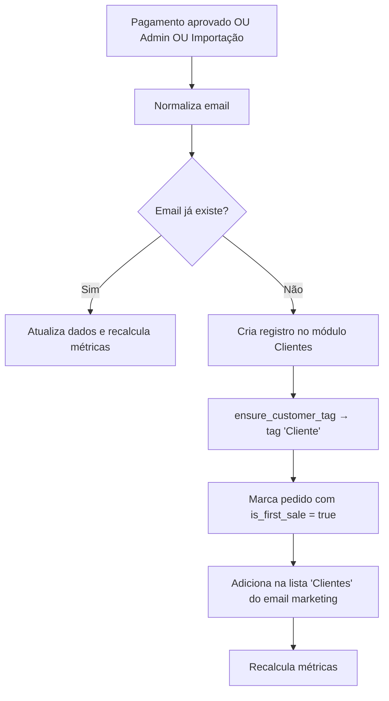

# Módulo: Clientes (Admin)

> **Status:** ✅ Ativo  
> **Camada:** Layer 3 — Especificações / E-commerce  
> **Última atualização:** 2026-04-04  
> **Migrado de:** `docs/regras/clientes.md`

---

## 1. Visão Geral

CRM integrado ao e-commerce. Identidade do cliente baseada exclusivamente no **email** (normalizado via `trim().toLowerCase()`), não no CPF ou auth.uid().

**REGRA FUNDAMENTAL (v2026-04-04):** Cliente só é criado no módulo de Clientes após pagamento aprovado. Checkout sem pagamento aprovado NÃO cria cliente — os dados ficam na `checkout_session` até a aprovação.

---

## 2. Arquitetura de Componentes

### 2.1 Páginas

| Arquivo | Responsabilidade |
|---------|------------------|
| `src/pages/Customers.tsx` | Lista com busca, filtros, tags e paginação |
| `src/pages/CustomerDetail.tsx` | Perfil completo com abas |
| `src/pages/CustomerNew.tsx` | Criação de novo cliente |

### 2.2 Componentes

| Arquivo | Responsabilidade |
|---------|------------------|
| `CustomerList.tsx` | Tabela de clientes com status, tier e ações |
| `CustomerForm.tsx` | Formulário completo de criação/edição |
| `CustomerAddressForm.tsx` | Formulário de endereço |
| `CustomerTagsManager.tsx` | Gerenciador de tags (CRUD) |
| `CustomerImport.tsx` | Importação em lote (CSV) |
| `CustomerInfoPanel.tsx` | Painel resumo (usado no suporte) |

### 2.3 Hooks

| Arquivo | Responsabilidade |
|---------|------------------|
| `useCustomers.ts` | CRUD via coreCustomersApi |
| `useCustomerOrders.ts` | Pedidos do cliente (por email) |

### 2.4 Edge Functions

| Função | Responsabilidade |
|--------|------------------|
| `core-customers` | API canônica: create, update, delete, addAddress, updateTags, addNote |
| `import-customers` | Importação em lote |
| `assign-tag-to-all-customers` | Atribuição de tag em massa |

---

## 3. Modelo de Dados

### 3.1 Tabela `customers`

```typescript
interface Customer {
  id: string;                    // UUID PK
  tenant_id: string;             // FK → tenants
  auth_user_id: string | null;   // FK → auth.users (se tiver conta)
  
  // === Identificação ===
  email: string;                 // ÚNICO por tenant (normalizado)
  full_name: string;
  cpf: string | null;            // Opcional, apenas fiscal
  phone: string | null;
  birth_date: string | null;
  gender: 'male' | 'female' | 'other' | 'not_informed' | null;
  
  // === Pessoa Jurídica ===
  person_type: 'pf' | 'pj' | null;
  cnpj: string | null;
  company_name: string | null;
  ie: string | null;             // Inscrição Estadual
  state_registration_is_exempt: boolean | null;
  rg: string | null;
  
  // === Status ===
  status: 'active' | 'inactive' | 'blocked' | null;
  email_verified: boolean | null;
  phone_verified: boolean | null;
  
  // === Marketing ===
  accepts_email_marketing: boolean | null;
  accepts_sms_marketing: boolean | null;
  accepts_whatsapp_marketing: boolean | null;
  unsubscribed_at: string | null;
  bounced_at: string | null;
  
  // === Métricas (via trigger recalc_customer_metrics) ===
  total_orders: number | null;
  total_spent: number | null;
  average_ticket: number | null;
  first_order_at: string | null;
  last_order_at: string | null;
  
  // === Fidelidade (dinâmica por tenant — percentis) ===
  loyalty_points: number | null;
  loyalty_tier: 'bronze' | 'silver' | 'gold' | 'platinum' | null;
  
  // === Origem ===
  last_source_platform: string | null;
  last_external_id: string | null;
  
  // === Notas ===
  notes: string | null;          // Campo de texto livre
  
  created_at: string;
  updated_at: string;
}
```

> **⚠️ IMPORTANTE:** `total_orders` NÃO é usado para "1ª compra". A tarja usa `orders.is_first_sale` (flag imutável, definida apenas quando o pagamento é aprovado e o email é novo no tenant).

### 3.2 Tabela `customer_addresses`

```typescript
interface CustomerAddress {
  id: string;
  customer_id: string;           // FK → customers
  label: string;                 // Ex: "Casa", "Trabalho"
  is_default: boolean;
  recipient_name: string;
  recipient_cpf: string | null;
  recipient_phone: string | null;
  street: string;
  number: string;
  complement: string | null;
  neighborhood: string;
  city: string;
  state: string;                 // 2 caracteres (UF)
  postal_code: string;
  country: string;               // Default: "BR"
  reference: string | null;      // Ponto de referência
  ibge_code: string | null;
  address_type: 'residential' | 'commercial' | 'other' | null;
  created_at: string;
  updated_at: string;
}
```

### 3.3 Tabela `customer_tags`

```typescript
interface CustomerTag {
  id: string;
  tenant_id: string;
  name: string;                  // Único por tenant
  color: string;                 // Hex color
  description: string | null;
  created_at: string;
}
```

### 3.4 Tabela `customer_tag_assignments`

```typescript
interface CustomerTagAssignment {
  id: string;
  customer_id: string;
  tag_id: string;
  created_at: string;
}
```

### 3.5 Tabela `customer_notes`

```typescript
interface CustomerNote {
  id: string;
  customer_id: string;
  author_id: string;             // Quem escreveu
  content: string;
  is_pinned: boolean;
  created_at: string;
  updated_at: string;
}
```

---

## 4. Fluxos de Negócio

### 4.1 Identidade por Email

```
REGRA FUNDAMENTAL:
- Cliente identificado EXCLUSIVAMENTE por email (normalizado: trim().toLowerCase())
- CPF é opcional, apenas fiscal
- auth.uid() NÃO vincula cliente
- Pedidos persistem com orders.customer_email
- Mesmo cliente com emails diferentes = registros separados (MVP)
```

### 4.2 Criação de Cliente (v2026-04-04)



**REGRA CRÍTICA (v2026-04-04):** Cliente NÃO é criado no clique de "Finalizar Compra". O checkout armazena os dados pessoais na `checkout_session`. O registro no módulo de Clientes só acontece quando:
- **Pagamento aprovado** → trigger automático cria cliente
- **Criação manual** → admin cria pelo painel
- **Importação** → CSV via wizard

### 4.3 Contrato Lead ≠ Cliente Potencial ≠ Customer (CRÍTICO — v2026-04-04)

```
REGRAS FUNDAMENTAIS:

1. Lead NÃO cria customer automaticamente
   - Formulários, popups, chat usam upsert_subscriber_only() → só cria subscriber
   - Se já existir customer com mesmo email, vincula (customer_id no subscriber)
   - Se NÃO existir customer → NÃO cria

2. Cliente Potencial NÃO é Customer (NOVO v2026-04-04)
   - Checkout abandonado insere na lista "Cliente Potencial" do email marketing
   - Usa upsert_subscriber_only() → NÃO cria customer
   - É um estado intermediário entre Subscriber e Customer no lifecycle
   - Tag sistêmica: "Cliente Potencial" (cor: #f97316, laranja)

3. Customer é criado APENAS por:
   - Pedido com pagamento APROVADO (não no clique de "Finalizar")
   - Criação manual (admin)
   - Importação (CSV)

4. Tag "Cliente" é atribuída por:
   - trg_auto_tag_cliente_on_payment → pedido aprovado
   - core-customers → criação manual (via ensure_customer_tag)
   - import-customers → importação (via customer_tag_assignments)

5. Customer sem email:
   - É customer válido (tags, métricas funcionam via customer_id)
   - NÃO cria subscriber/list_member (email obrigatório para marketing)
   - Trigger registra evento auditável via log_marketing_sync_audit com status=skipped
```

### 4.4 Lifecycle do Contato (v2026-04-04)

```
Lead → Subscriber → Cliente Potencial → Customer
                         |                    |
                   checkout abandonado    pedido real com pagamento aprovado
```

| Estado | Trigger | Tag sistêmica | Lista de email |
|--------|---------|---------------|----------------|
| Lead | Captura de contato | — | — |
| Subscriber | Opt-in confirmado | — | Lista específica |
| Cliente Potencial | Checkout abandonado | `Cliente Potencial` (#f97316) | `Cliente Potencial` |
| Customer | Pagamento aprovado | `Cliente` (#10B981) | `Clientes` |

**Progressão natural:** Um contato pode progredir de Lead → Subscriber → Cliente Potencial → Customer conforme interage com a loja. A progressão NÃO é obrigatória — um contato pode ir direto de Lead para Customer se fizer uma compra sem ter passado por checkout abandonado.

### 4.5 Funções de Banco — Contrato de Responsabilidades

| Função | Responsabilidade | O que NÃO faz |
|--------|-----------------|---------------|
| `upsert_subscriber_only` | Cria/atualiza subscriber, adiciona em lista, vincula a customer existente | NÃO cria customer |
| `ensure_customer_tag` | Atribui tag sistêmica a customer por ID | NÃO cria customer nem subscriber |
| `recalc_customer_metrics` | Recalcula métricas de compra | NÃO atribui tags |
| `auto_tag_cliente_on_payment_approved` | Atribui tag "Cliente" quando pagamento aprovado | NÃO depende de lista de marketing |

### 4.6 Triggers Ativos na Tabela `orders`

| Trigger | Função | Quando dispara | O que faz |
|---------|--------|----------------|-----------|
| `trg_auto_tag_cliente_on_payment` | `auto_tag_cliente_on_payment_approved()` | INSERT/UPDATE de payment_status | Se `approved`: atribui tag "Cliente" via customer_id |
| `trg_recalc_customer_metrics_on_order` | `trg_recalc_customer_on_order()` | INSERT/UPDATE | Se `approved`: recalcula métricas + sincroniza subscriber (sem criar customer) |

### 4.7 Nomes Canônicos

| Conceito | Nome no banco | Chave de busca |
|----------|--------------|----------------|
| Tag sistêmica (cliente) | `Cliente` (singular) | `customer_tags.name = 'Cliente'` |
| Tag sistêmica (potencial) | `Cliente Potencial` | `customer_tags.name = 'Cliente Potencial'` |
| Lista de marketing (clientes) | `Clientes` (plural) | `email_marketing_lists.tag_id` → tag "Cliente" |
| Lista de marketing (potenciais) | `Cliente Potencial` | `email_marketing_lists.tag_id` → tag "Cliente Potencial" |

### 4.8 Métricas Automáticas

| Campo | Cálculo |
|-------|---------|
| `total_orders` | COUNT(orders) onde payment_status='approved' e total>0 |
| `total_spent` | SUM(orders.total) dos aprovados |
| `average_ticket` | total_spent / total_orders |
| `first_order_at` | MIN(orders.created_at) dos aprovados |
| `last_order_at` | MAX(orders.created_at) dos aprovados |

### 4.9 Tiers de Fidelidade (Progressão Dinâmica por Tenant)

Os limites são calculados com base na distribuição real de gastos dos clientes do tenant, usando percentis:

| Tier | Critério |
|------|----------|
| Bronze | Abaixo do percentil 50 |
| Silver | Percentil 50-75 |
| Gold | Percentil 75-90 |
| Platinum | Top 10% (acima do percentil 90) |

Calculado dinamicamente por `recalc_customer_metrics`. Clientes sem compras ficam como Bronze.

---

## 5. UI/UX

### 5.1 Lista de Clientes

| Elemento | Comportamento |
|----------|---------------|
| Busca | Por nome, email, telefone |
| Filtros | Status (ativo, inativo, bloqueado) |
| Tags | Botão para gerenciar tags |
| Estatísticas | Total de clientes, novos no mês |
| Importação | CSV via wizard (`useImportData` → motor `import-customers`) |
| Ações | Ver, Editar, Excluir |
| Paginação | 50 por página |

### 5.2 Detalhes do Cliente

| Seção | Conteúdo |
|-------|----------|
| **Cabeçalho** | Avatar, nome, badges (status, tier) |
| **Dados Pessoais** | Email, telefone, CPF, nascimento |
| **Empresa** | CNPJ, razão social, IE (se PJ) |
| **Métricas** | Pedidos, total gasto, ticket médio |
| **Endereços** | Lista com ações (editar, excluir, definir padrão) |
| **Tags** | Tags atribuídas, adicionar/remover |
| **Notas** | Notas internas com autor e data |
| **Histórico** | Lista de pedidos recentes |

### 5.3 Abas na Página de Detalhe

| Aba | Conteúdo |
|-----|----------|
| **Perfil** | Dados cadastrais editáveis |
| **Pedidos** | Histórico de compras |
| **Endereços** | Gerenciamento |
| **Notificações** | Histórico de comunicações |

---

## 6. Segmentação com Tags

### 6.1 Uso de Tags

- Organização de clientes em grupos
- Filtro em campanhas de email marketing
- Regras de desconto por segmento
- Atendimento personalizado

### 6.2 Tags Sistêmicas

| Tag | Cor | Atribuição automática |
|-----|-----|----------------------|
| `Cliente` | `#10B981` (verde) | Pedido com pagamento aprovado |
| `Cliente Potencial` | `#f97316` (laranja) | Checkout abandonado |

### 6.3 Cores Disponíveis

```typescript
const colorOptions = [
  '#6366f1', // Indigo
  '#8b5cf6', // Violet
  '#ec4899', // Pink
  '#ef4444', // Red
  '#f97316', // Orange
  '#eab308', // Yellow
  '#22c55e', // Green
  '#14b8a6', // Teal
  '#06b6d4', // Cyan
  '#3b82f6', // Blue
];
```

---

## 7. Importação de Clientes

### 7.1 Formato

O importador aceita CSVs de qualquer plataforma (Shopify, WooCommerce, Nuvemshop, Tray, genérico). Separadores `,` e `;`.

### 7.2 Mapeamento de Headers

| Campo do sistema | Headers aceitos |
|------------------|----------------|
| email | `email`, `e-mail`, `email address`, `customer email` |
| full_name | `name`, `full_name`, `nome`, `nome completo`, `First Name + Last Name` |
| phone | `phone`, `telefone`, `celular`, `mobile`, `whatsapp` |
| cpf | `cpf`, `document`, `documento`, `tax id` |
| status | `status`, `state` (default: active) |
| accepts_marketing | `accepts_marketing`, `marketing`, `aceita marketing` |
| birth_date | `birth_date`, `birthday`, `data_nascimento`, `nascimento` |
| gender | `gender`, `sexo`, `gênero` |

### 7.3 Comportamento

- Emails duplicados no mesmo arquivo são ignorados
- Reimportação faz merge inteligente: preenche apenas campos vazios/nulos
- Dados existentes nunca são sobrescritos por valores vazios
- Case-insensitive no email (normaliza para lowercase)
- Endereços só preenchidos quando o cliente não possui endereço
- Clientes importados são adicionados como subscribers na lista de marketing
- Relatório ao final: importados/atualizados/ignorados/erros

---

## 8. Consentimentos de Marketing

| Campo | Uso |
|-------|-----|
| `accepts_email_marketing` | Específico para email |
| `accepts_sms_marketing` | Específico para SMS |
| `accepts_whatsapp_marketing` | Específico para WhatsApp |
| `unsubscribed_at` | Data de opt-out |
| `bounced_at` | Data de bounce de email |

---

## 9. Validações

| Campo | Regra |
|-------|-------|
| `email` | Obrigatório, formato válido, único por tenant |
| `full_name` | Obrigatório, min 2 caracteres |
| `cpf` | Opcional, formato válido se informado |
| `phone` | Opcional, formato válido se informado |

---

## 10. Exclusão

- Clientes com pedidos: soft delete (`status = 'inactive'`)
- `coreCustomersApi.checkDependencies` verifica vínculos
- Dependências verificadas: pedidos, conversas, endereços, notas, tags

---

## 11. Integração com Outros Módulos

| Módulo | Integração |
|--------|------------|
| Pedidos | Vínculo por `customer_email`. Cliente criado apenas após pagamento aprovado |
| Checkout | Dados armazenados na `checkout_session` até pagamento aprovado |
| Checkouts Abandonados | Checkout abandonado → lista "Cliente Potencial" (NÃO cria customer) |
| Email Marketing | Segmentação por tags e consentimento. Listas: "Clientes" e "Cliente Potencial" |
| Suporte | Painel de informações do cliente |
| Descontos | Cupons de primeira compra |
| Notificações | Comunicações transacionais |

---

## 12. Permissões (RBAC)

| Rota | Módulo | Submódulo |
|------|--------|-----------|
| `/customers` | `ecommerce` | `customers` |
| `/customers/:id` | `ecommerce` | `customers` |
| `/customers/new` | `ecommerce` | `customers` |

---

## 13. Componentes de Data Padronizados

| Campo | Componente | Tela |
|-------|------------|------|
| `birth_date` | `DatePickerField` | CustomerForm, CustomerDetail |

---

## 14. Arquivos Relacionados

- `src/pages/Customers.tsx`
- `src/pages/CustomerDetail.tsx`
- `src/components/customers/*`
- `src/hooks/useCustomers.ts`
- `src/hooks/useCustomerOrders.ts`
- `src/lib/coreApi.ts` (coreCustomersApi)
- `src/lib/normalizeEmail.ts`
- `supabase/functions/core-customers/`
- `supabase/functions/import-customers/`

---

## 15. Pendências

- [x] ~~Exportação de clientes (CSV)~~ — Implementado
- [x] ~~Progressão automática de tier~~ — Implementado
- [x] ~~Métricas recalculadas~~ — Implementado
- [x] ~~Importação universal~~ — Implementado
- [x] ~~Sync com email marketing~~ — Implementado
- [x] ~~Auditoria de skip sem email~~ — Implementado (tabela `email_marketing_sync_audit`)
- [x] ~~Conceito "Cliente Potencial"~~ — Especificado (v2026-04-04)
- [x] ~~Lifecycle Lead→Subscriber→Potencial→Customer~~ — Especificado (v2026-04-04)
- [ ] Merge de clientes duplicados
- [ ] Histórico de alterações do perfil
- [ ] Validação de telefone (SMS)
- [ ] Integração com fidelidade externos

---

*Fim do documento.*
