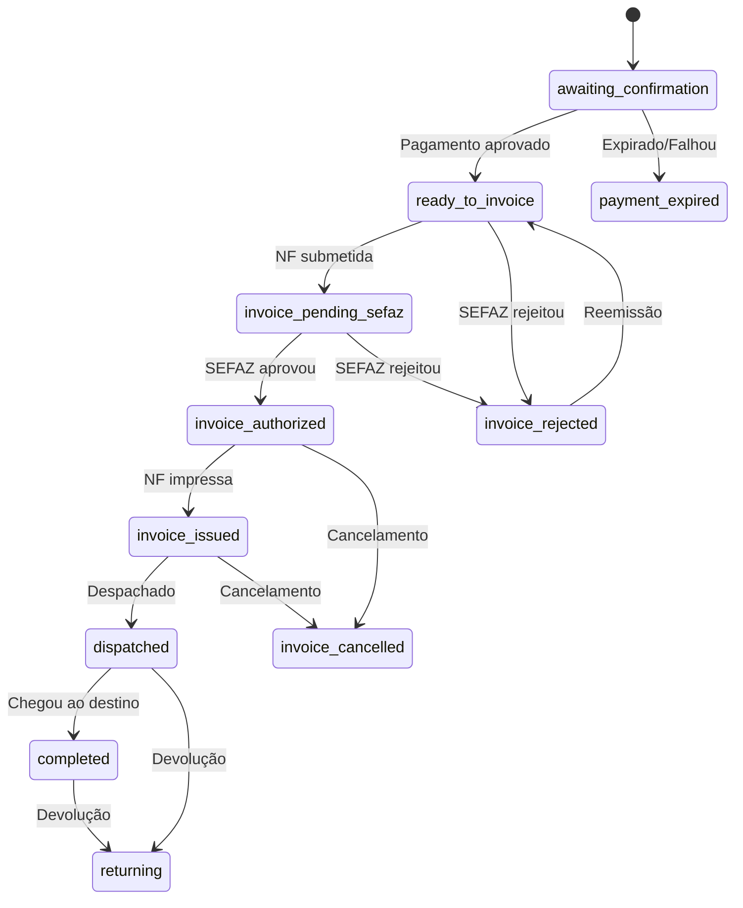
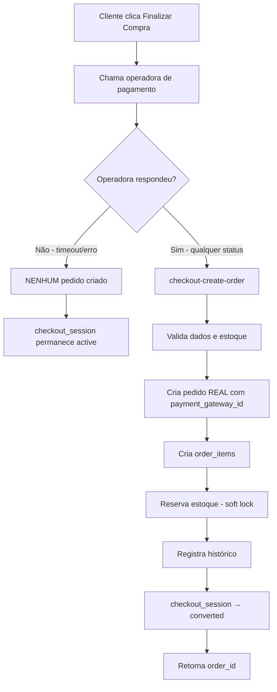
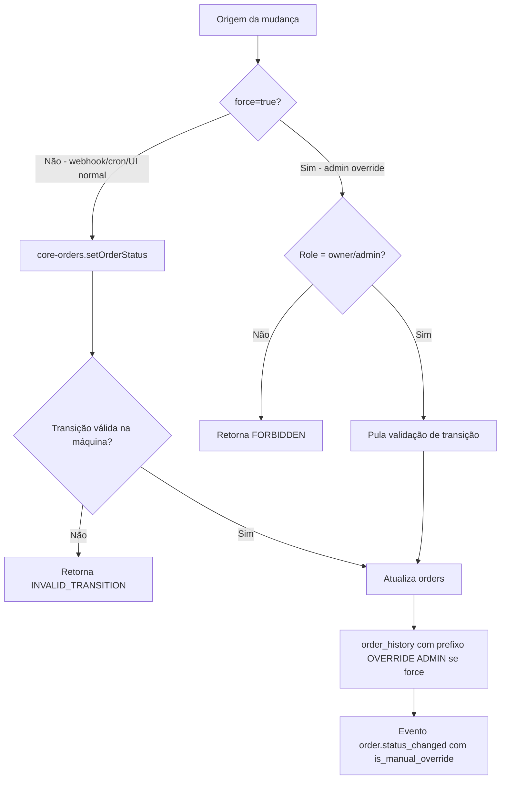

# Módulo: Pedidos (Admin)

> **Status:** ✅ Ativo  
> **Camada:** Layer 3 — Especificações / E-commerce  
> **Última atualização:** 2026-04-04  
> **Migrado de:** `docs/regras/pedidos.md`

---

## 1. Visão Geral

O módulo de Pedidos gerencia todo o ciclo de vida de uma venda, desde a criação até a entrega. Implementa uma máquina de estados para status do pedido, pagamento e envio, garantindo transições válidas. Todas as operações passam pela Edge Function `core-orders` para auditoria e consistência.

**REGRA FUNDAMENTAL (v2026-04-04, reforçada em v2026-04-19):** Pedidos só são criados após resposta da operadora de pagamento. Não existem mais "ghost orders". A numeração da loja só é consumida para pedidos reais.

> **v2026-04-19 — Pagar.me alinhado à regra:** A edge `pagarme-create-charge` agora opera como orquestrador (gateway-first): chama a Pagar.me primeiro e, somente após resposta, invoca `checkout-create-order` com `payment_gateway_id` já preenchido. A edge `checkout-create-order` rejeita qualquer criação de pedido sem `payment_gateway_id` (código `GATEWAY_CONFIRMATION_REQUIRED`). Falha técnica antes da resposta do gateway = nenhum pedido criado, nenhuma numeração consumida, sessão segue para o fluxo padrão de checkout abandonado em 30 min. Mercado Pago já seguia a regra (criação só via webhook).

---

## 2. Arquitetura de Componentes

### 2.1 Páginas

| Arquivo | Responsabilidade |
|---------|------------------|
| `src/pages/Orders.tsx` | Lista de pedidos com filtros, estatísticas e paginação |
| `src/pages/OrderDetail.tsx` | Detalhes do pedido, itens, histórico, notas, rastreio |
| `src/pages/OrderNew.tsx` | Criação manual de pedidos. Depende do scroll global único do `AppShell`; não deve criar segundo scroll estrutural nem compensação extra de altura no contêiner raiz |

### 2.2 Componentes

| Arquivo | Responsabilidade |
|---------|------------------|
| `OrderList.tsx` | Tabela com badges de status e ações |
| `OrderSourceBadge.tsx` | Badge de origem (Loja, ML, Shopee) |
| `OrderShippingMethod.tsx` | Método de envio |
| `ShipmentSection.tsx` | Rastreio e envio |
| `PaymentAttemptsCard.tsx` | Histórico de tentativas de pagamento |
| `OrderAlertsCard.tsx` | Alertas operacionais de pedidos (chargebacks) — exibido na Central de Execuções, aba Pedidos |

### 2.3 Hooks

| Arquivo | Responsabilidade |
|---------|------------------|
| `useOrders.ts` | Lista, cria, atualiza status, deleta via coreOrdersApi |
| `useOrderDetails.ts` | Busca pedido por ID/número via Edge Function |
| `useCustomerOrders.ts` | Pedidos do cliente logado (storefront) |
| `usePaymentTransactions.ts` | Tentativas de pagamento por order_id |
| `useRetryLinkedOrder.ts` | Vínculo bidirecional de retry |

### 2.4 Edge Functions

| Função | Responsabilidade |
|--------|------------------|
| `core-orders` | API canônica: createOrder, setOrderStatus, setPaymentStatus, setShippingStatus, addNote, updateTracking, deleteOrder |
| `get-order` | Busca segura (bypassa RLS para guest). Aceita com/sem `#`, normaliza. Ordena `created_at DESC LIMIT 1` para duplicatas |
| `checkout-create-order` | Criação de pedido via checkout do storefront — **só executa após resposta do gateway** |
| `shipment-ingest` | Ingestão de dados de envio/rastreio |
| `verify-payment-status` | Verificação ativa do status de pagamento junto à operadora (cron progressivo) |
| `monitor-chargebacks` | Monitoramento pós-venda de estornos (cron diário, 60 dias) |

---

## 3. Modelo de Dados

### 3.1 Tabela `orders`

```typescript
interface Order {
  id: string;                    // UUID PK
  tenant_id: string;             // FK → tenants
  customer_id: string | null;    // FK → customers
  order_number: string;          // Sequencial por tenant (#XXXX)
  
  // === Status ===
  status: OrderStatus;
  payment_status: PaymentStatus;
  shipping_status: ShippingStatus;
  
  // === Valores ===
  subtotal: number;
  discount_total: number;
  shipping_total: number;
  tax_total: number;
  total: number;                 // subtotal - discount + shipping + tax
  
  // === Pagamento ===
  payment_method: PaymentMethod | null;
  payment_gateway: string | null;
  payment_gateway_id: string | null;
  paid_at: string | null;
  installments: number | null;
  installment_value: number | null;
  
  // === Primeira Compra ===
  is_first_sale: boolean;        // Imutável. true = email novo no tenant + pagamento aprovado
  
  // === Envio ===
  shipping_carrier: string | null;
  shipping_service_code: string | null;
  shipping_service_name: string | null;
  shipping_estimated_days: number | null;
  tracking_code: string | null;
  tracking_url: string | null;
  shipped_at: string | null;
  delivered_at: string | null;
  
  // === Cliente (snapshot) ===
  customer_name: string;
  customer_email: string;        // Normalizado (lowercase, trim)
  customer_phone: string | null;
  customer_cpf: string | null;
  
  // === Endereço de Entrega ===
  shipping_street: string | null;
  shipping_number: string | null;
  shipping_complement: string | null;
  shipping_neighborhood: string | null;
  shipping_city: string | null;
  shipping_state: string | null;
  shipping_postal_code: string | null;
  shipping_country: string | null;
  
  // === Endereço de Cobrança ===
  billing_street: string | null;
  billing_number: string | null;
  billing_complement: string | null;
  billing_neighborhood: string | null;
  billing_city: string | null;
  billing_state: string | null;
  billing_postal_code: string | null;
  billing_country: string | null;
  
  // === Notas ===
  customer_notes: string | null;  // Observações do cliente
  internal_notes: string | null;  // Notas internas (não visíveis ao cliente)
  
  // === Cancelamento ===
  cancelled_at: string | null;
  cancellation_reason: string | null;
  
  // === Marketplace ===
  source_order_number: string | null;
  source_platform: string | null;
  marketplace_source: string | null;
  marketplace_order_id: string | null;
  marketplace_data: Record<string, unknown> | null;
  
  // === Metadados ===
  currency: string | null;       // Default: BRL
  fx_rate: number | null;
  source_hash: string | null;    // Para deduplicação
  gateway_payload: Record<string, unknown> | null;
  
  // === Retry ===
  retry_from_order_id: string | null;
  retry_token: string | null;
  retry_token_expires_at: string | null;
  
  // === Auditoria ===
  canonical_total: number | null;
  checkout_attempt_id: string | null;  // UUID — idempotência
  
  // === Verificação de Pagamento ===
  next_payment_check_at: string | null;    // Próxima verificação agendada
  payment_check_count: number;             // Quantidade de verificações realizadas
  payment_max_expiry_at: string | null;    // Prazo máximo de expiração (consultado na operadora)
  chargeback_detected_at: string | null;   // Data de detecção do chargeback
  chargeback_deadline_at: string | null;   // Prazo final para resolução do chargeback
  
  created_at: string;
  updated_at: string;
}
```

### 3.1.1 Criação de Pedido — Regra Fundamental (v2026-04-04)

> **REGRA CRÍTICA:** Pedidos só existem após resposta da operadora de pagamento.

| Ponto | Descrição |
|-------|-----------|
| **Antes** | Pedido era criado no clique de "Finalizar Compra", antes da resposta do gateway. Isso gerava "ghost orders" sem `payment_gateway_id` |
| **Agora** | O sistema chama a operadora primeiro. Só após receber resposta (qualquer status: aprovado, recusado, pendente) é que o pedido é criado com numeração real |
| **Resultado** | Eliminação total de ghost orders. Todo pedido na base tem `payment_gateway_id` preenchido |

**Fluxo de criação:**
1. Cliente clica "Finalizar Compra"
2. Sistema chama a operadora de pagamento (Pagar.me, Mercado Pago, PagBank)
3. Operadora responde (qualquer status)
4. `checkout-create-order` cria o pedido real com `payment_gateway_id` preenchido
5. Numeração da loja é consumida (#XXXX)
6. Cliente é criado/atualizado no módulo de Clientes (somente se pagamento aprovado — ver seção 7.3)
7. `checkout_session` muda para `converted`

**Se a operadora NÃO responder** (timeout, erro de rede, tab fechada):
- NENHUM pedido é criado
- NENHUMA numeração é consumida
- A `checkout_session` permanece `active` → pode virar `abandoned` após 30 min

**Legado — Ghost Orders (encerrado em 2026-05-02):**
O conceito de "ghost order" (`payment_gateway_id IS NULL`) foi eliminado na v2026-04-04 pela regra gateway-first. Em 2026-05-02, os 79 pedidos legados pré-19/abr restantes (que ficaram pendentes/expirados sem `payment_gateway_id`) foram migrados para `cancelled` com motivo "Órfão pré-gateway-first". A partir desta data, **a listagem de pedidos NÃO filtra mais por `payment_gateway_id`** — esse filtro estava bloqueando indevidamente pedidos manuais (criados via `/orders/new`) e importações de marketplace, que legitimamente não têm `payment_gateway_id`. Regra anti-regressão: nunca reintroduzir `.not('payment_gateway_id', 'is', null)` em queries de listagem de pedidos. A integridade contra ghost orders é garantida pelo gateway-first na criação, não por filtro na leitura.

**Validação E2E (2026-05-02):** Pedido manual #392 (PIX/Pago) e #393 (Boleto/Pago, transportadora Correios) criados via `/orders/new` apareceram corretamente em `/orders`, `/fiscal?tab=pedidos` (status "Pronto para emitir NF") e `/logistica` (aba Aguardando Envio). Confirma que a remoção do filtro não introduziu efeitos colaterais e que pedidos manuais transitam pelo pipeline atomic-order-draft-trigger igual a pedidos do storefront.

**Validação E2E (2026-05-18) — Notificação ao cliente em pedido manual aprovado:** Pedido manual #474 criado já com pagamento aprovado disparou, na mesma execução: (a) rascunho fiscal (`fiscal_draft_queue` pending), (b) rascunho de remessa (`shipping_draft_queue` pending, provider Correios), (c) roteamento de transportadora preenchido (`resolved_shipping_provider_kind=contract`), (d) evento interno `payment_status_changed` processado, (e) notificações ao cliente **enviadas** nos dois canais (WhatsApp + e-mail). Regra: pedido nascido aprovado (`create_order` com `payment_status_initial='paid'`) é equivalente, do ponto de vista de notificação ao cliente, a pedido aprovado por webhook de gateway ou por botão "Marcar como pago". As três rotas alimentam o mesmo motor de regras de notificação — qualquer regressão que silencie uma das rotas é incidente bloqueante.

---

### 3.2 Tipos de Status

#### Status do Pedido

```typescript
type OrderStatus = 
  | 'awaiting_confirmation'    // Aguardando confirmação
  | 'ready_to_invoice'         // Pronto para emitir NF
  | 'invoice_pending_sefaz'    // Pendente SEFAZ
  | 'invoice_authorized'       // NF Autorizada
  | 'invoice_issued'           // NF Emitida
  | 'dispatched'               // Despachado
  | 'completed'                // Concluído
  | 'returning'                // Em devolução
  | 'payment_expired'          // Pagamento expirado
  | 'cancelled_by_user'        // Cancelado pelo usuário (NOVO v2026-05-19 — cascateado de set_payment_status='cancelled')
  | 'invoice_rejected'         // NF Rejeitada
  | 'invoice_cancelled'        // NF Cancelada
  | 'chargeback_detected'      // Chargeback detectado (NOVO v2026-04-07)
  | 'chargeback_lost'          // Chargeback perdido (NOVO v2026-04-07)
  | 'chargeback_recovered';    // Chargeback recuperado (NOVO v2026-04-07)
```

#### Status de Pagamento

```typescript
type PaymentStatus = 
  | 'awaiting_payment'       // Aguardando
  | 'paid'                   // Pago
  | 'declined'               // Recusado
  | 'cancelled'              // Cancelado
  | 'refunded'               // Estornado
  | 'under_review'           // Em análise — chargeback em andamento (NOVO v2026-04-07)
  | 'chargeback_requested';  // Estorno solicitado (legado, substituído por under_review)
```

#### Status de Envio

```typescript
type ShippingStatus = 
  | 'awaiting_shipment' | 'label_generated' | 'shipped'
  | 'in_transit' | 'arriving' | 'delivered'
  | 'problem' | 'awaiting_pickup' | 'returning' | 'returned';
```

### 3.3 Tabela `order_items`

```typescript
interface OrderItem {
  id: string;
  order_id: string;
  product_id: string | null;
  variant_id: string | null;
  sku: string;
  product_name: string;
  variant_name: string | null;
  product_slug: string | null;
  product_image_url: string | null;
  quantity: number;
  unit_price: number;
  discount_amount: number;
  total_price: number;           // (unit_price * quantity) - discount
  weight: number | null;
  tax_amount: number | null;
  cost_price: number | null;
  barcode: string | null;
  ncm: string | null;
  tenant_id: string | null;
  created_at: string;
}
```

### 3.4 Tabela `order_history`

```typescript
interface OrderHistory {
  id: string;
  order_id: string;
  author_id: string | null;
  action: string;                // "status_change", "note_added"
  previous_value: Record<string, unknown> | null;
  new_value: Record<string, unknown> | null;
  description: string | null;
  created_at: string;
}
```

---

## 4. Máquina de Estados

### 4.1 Transições de Status do Pedido



> **Anti-regressão (2026-06-22) — Independência dos 3 status.**
> `orders.status` (ciclo de vida), `orders.payment_status` (pagamento) e
> `orders.shipping_status` (rastreio) são **independentes**. Cada motor escreve
> apenas no campo que lhe pertence:
>
> - **Autorização da NF** (`nfe-shipment-link`): grava `status='invoice_authorized'`
>   somente se o pedido ainda estiver em estágio pré-NF. **NUNCA** grava o legado
>   `processing` — isso fazia o pedido aparecer como "Pronto para emitir NF" mesmo
>   após a emissão (incidente #637/#638 do tenant Respeite o Homem). Não toca em
>   `payment_status` nem `shipping_status`.
> - **Etiqueta gerada/posta** (`shipment-ingest`): promove `status='dispatched'`
>   quando vem do conjunto pré-despacho (`paid, processing, ready_to_invoice,
>   invoice_pending_sefaz, invoice_authorized, invoice_issued, awaiting_shipment,
>   pending, fulfilled`). Atualiza `shipping_status` com vocabulário canônico
>   (`label_generated, shipped, in_transit, arriving, delivered, problem, returned`).
> - **Pagamento**: somente os webhooks de gateway gravam `payment_status`.

### 4.2 Transições de Pagamento

| De | Para | Válido | Descrição |
|----|------|--------|-----------|
| `awaiting_payment` | `paid`, `declined`, `cancelled` | ✅ | Resposta inicial do gateway |
| `paid` | `refunded`, `under_review` | ✅ | Estorno ou chargeback detectado |
| `under_review` | `paid` | ✅ | Chargeback recuperado |
| `under_review` | `refunded` | ✅ | Chargeback perdido |
| `declined` | `awaiting_payment`, `cancelled` | ✅ | Retry ou cancelamento |
| `cancelled` | - | ❌ (final) | - |
| `refunded` | - | ❌ (final) | - |

### 4.3 Transições de Envio

| De | Para | Válido |
|----|------|--------|
| `awaiting_shipment` | `label_generated`, `problem` | ✅ |
| `label_generated` | `shipped`, `problem` | ✅ |
| `shipped` | `in_transit`, `problem` | ✅ |
| `in_transit` | `arriving`, `delivered`, `problem`, `awaiting_pickup` | ✅ |
| `arriving` | `delivered`, `problem` | ✅ |
| `delivered` | `returning` | ✅ |
| `problem` | `awaiting_shipment`, `returning`, `returned` | ✅ |
| `awaiting_pickup` | `delivered`, `returning` | ✅ |
| `returning` | `returned` | ✅ |
| `returned` | - | ❌ (final) |

### 4.4 Transições Automáticas

| Evento | De (status) | Para (status) | De (payment) | Para (payment) | Mecanismo |
|--------|-------------|---------------|--------------|-----------------|-----------|
| Webhook pagamento aprovado | `awaiting_confirmation` | `ready_to_invoice` | `awaiting_payment` | `paid` | `pagarme-webhook` / webhook da operadora |
| Verificação ativa: pagamento aprovado | `awaiting_confirmation` | `ready_to_invoice` | `awaiting_payment` | `paid` | `verify-payment-status` (cron) |
| Verificação ativa: expirado/cancelado | `awaiting_confirmation` | `payment_expired` | — | `cancelled` | `verify-payment-status` (cron) |
| Chargeback detectado | `*` (qualquer) | `chargeback_detected` | `paid`/`approved` | `under_review` | `monitor-chargebacks` (cron) |
| Chargeback recuperado | `chargeback_detected` | (restaura status anterior) | `under_review` | `paid` | `monitor-chargebacks` (cron) |
| Chargeback perdido | `chargeback_detected` | `chargeback_lost` | `under_review` | `refunded` | `monitor-chargebacks` (cron) |
| Chargeback prazo excedido | `chargeback_detected` | `chargeback_lost` | `under_review` | `refunded` | `monitor-chargebacks` (cron) |
| Estorno direto (sem disputa) | — | — | `paid`/`approved` | `refunded` | `monitor-chargebacks` (cron) |

### 4.5 Normalização de Status (ANTI-REGRESSÃO)

Todo lookup de status na UI **DEVE** usar funções de normalização:

```typescript
// ✅ CORRETO
const normalizedStatus = normalizeOrderStatus(order.status);
const cfg = ORDER_STATUS_CONFIG[normalizedStatus];

// ❌ PROIBIDO
const cfg = ORDER_STATUS_CONFIG[order.status as OrderStatus] || ORDER_STATUS_CONFIG.awaiting_confirmation;
```

| Função | Mapeia |
|--------|--------|
| `normalizeOrderStatus()` | `pending→awaiting_confirmation`, `paid→ready_to_invoice`, `cancelled→payment_expired`, `delivered→completed`, `chargeback_detected→chargeback_detected`, `chargeback_lost→chargeback_lost` |
| `normalizePaymentStatus()` | `approved→paid`, `pending→awaiting_payment`, `chargeback_requested→under_review`, `under_review→under_review` |
| `normalizeShippingStatus()` | `pending→awaiting_shipment`, `processing→label_generated` |

---

### 4.6 Sincronia Cross-Module em Regressão (v2026-05-01)

**Problema resolvido:** quando um pedido aprovado avança para o fluxo Fiscal e Logístico (NF-e emitida, etiqueta despachada) e depois regride por um motivo legítimo (cancelamento manual, chargeback detectado, pagamento expirado pós-aprovação, devolução), os módulos a jusante deixavam o documento/etiqueta ativos sem alerta. Resultado: NF-e válida para venda inexistente, etiqueta gerada para pedido cancelado, métricas de cliente infladas e rascunhos órfãos nas filas.

**Estados regressivos canônicos:**
`cancelled`, `returned`, `returning`, `chargeback_detected`, `chargeback_lost`, `payment_expired`, `invoice_cancelled`.

**Pipeline obrigatório (toda transição que entra em estado regressivo):**

| Camada | Componente | Responsabilidade |
|--------|------------|------------------|
| 1. Trigger DB | `handle_order_fiscal_alert` | Marca `fiscal_invoices.requires_action = true` + `action_reason` em NF-e `authorized` do pedido |
| 1. Trigger DB | `handle_order_shipping_alert` | Marca `shipments.requires_action = true` + `action_reason` em remessas não entregues |
| 1. Trigger DB | `cancel_pending_drafts_on_regression` | Cancela linhas `pending`/`processing` em `fiscal_draft_queue`, `shipping_draft_queue`, `gateway_sync_queue` (preenche `cancelled_at` + `cancel_reason`) |
| 1. Trigger DB | `handle_customer_regression` | Dispara `recalc_customer_metrics` para reverter tags/métricas (ex.: comprador frequente) |
| 2. Edge Function | `order-regression-handler` | Orquestrador idempotente. Reforça as marcações acima e registra entrada em `order_history` com sumário (`regression_handled`). Chamado fire-and-forget pelo `core-orders` em toda transição regressiva manual ou automática, e por webhooks (chargeback/estorno) e cron `expire-stale-orders` |
| 2. Edge Function | `fiscal-cancel` | Ao cancelar NF-e autorizada, registra log no `order_history` e sinaliza remessas pendentes para revisão manual |
| 3. UI | `OrderRegressionBanner` (em `OrderDetail`) | Exibe NF-e e etiquetas com `requires_action = true`, motivo da regressão e ação manual sugerida |
| 3. UI | `ExecutionsQueue` (Central de Execuções) | Cards "Pedidos" e "Notas Fiscais" expõem stats `Etiquetas a reverter` e `NF-e a cancelar (regressão)` |

**O que NÃO é automático (decisão de produto):**
- Cancelamento ativo de NF-e autorizada (exige justificativa fiscal e prazo SEFAZ).
- Cancelamento de etiqueta já despachada (exige processo logístico de devolução).

A automação **sinaliza**; a ação destrutiva fica com o operador. A bandeira `requires_action` só é limpa por ação humana via `fiscal-cancel` (NF-e) ou ação explícita na tela de Remessas (etiqueta).

**Colunas de auditoria adicionadas:**
- `fiscal_invoices.requires_action`, `action_reason`, `action_dismissed_at`
- `shipments.requires_action`, `action_reason`
- `fiscal_draft_queue` / `shipping_draft_queue` / `gateway_sync_queue`: `cancelled_at`, `cancel_reason`

**Detalhe técnico crítico (lições do teste E2E 2026-05-01):**
- As 4 funções de trigger comparam `orders.status` (enum `order_status`) contra `TEXT[]` de estados regressivos. **Postgres não casta enum→text implicitamente em `ANY()`** — sem `NEW.status::text` e `OLD.status::text` toda `UPDATE orders` falha com erro `42883` e bloqueia pagamento, cancelamento, webhooks e cron de expiração em produção. Validação obrigatória ao alterar essas funções: rodar um `UPDATE orders SET status='awaiting_confirmation' WHERE id=...` real antes de fechar a entrega.
- Quando `resolve_order_shipping_provider` retorna `unresolved` (pedido sem CEP/transportadora resolvida), o pipeline atual ainda enfileira em `shipping_draft_queue` com `provider='manual'` como fallback. Comportamento intencional para que o operador receba a remessa na tela manual.

**Teste E2E executado em 2026-05-01:**
- 1 pedido fluxo feliz: `pending → awaiting_confirmation → ready_to_invoice → invoice_pending_sefaz → invoice_authorized → invoice_issued → dispatched → completed` ✅
- 5 pedidos regressão: `cancelled`, `payment_expired`, `invoice_cancelled`, `chargeback_detected`, `returned` — todas as 4 triggers e o handler comportaram como especificado ✅
- Teste rodou no tenant Respeite o Homem com pedidos/cliente/NF-e/remessas marcados `[E2E-TEST]` e `[E2E-REG]`, removidos integralmente ao fim sem rastro.

**Anti-regressão:** ver `mem://constraints/order-cross-module-sync-on-regression`.

---

## 5. Fluxos de Negócio

### 5.1 Criação via Checkout (v2026-04-04)



### 5.2 Atualização de Status

Existem **duas vias** de atualização — fluxo automático (rígido) e override administrativo (flexível com auditoria).



#### 5.2.1 Fluxo Automático (sem `force`)
- Webhooks de pagamento, crons (`verify-payment-status`, `monitor-chargebacks`), automações fiscais e de envio **NUNCA** enviam `force: true`.
- Tentativa de transição inválida retorna `INVALID_TRANSITION` — comportamento intencional para proteger integridade do fluxo.

#### 5.2.2 Override Administrativo (`force: true`)
- Disponível em `set_order_status`, `set_payment_status`, `set_shipping_status` da edge `core-orders`.
- Validação server-side: apenas membros com role `owner` ou `admin` (operador é negado com `FORBIDDEN`).
- Pula `isValidTransition` e permite qualquer destino dentro do enum válido.
- Auditoria obrigatória:
  - `audit_logs.action = 'set_*_status_override'` com `manual_override: true` em `after_json`.
  - `order_history.description` recebe prefixo `[OVERRIDE ADMIN]`.
  - Evento publicado em `order_events` carrega `is_manual_override: true` no payload — consumidores externos (notificações, fiscal, etc.) decidem se reagem.
- Frontend (`OrderDetail.tsx`) espelha a máquina em `src/lib/orderTransitions.ts` apenas para detectar transições não naturais e abrir `OrderStatusOverrideDialog` listando consequências (NFe draft, recálculo de LTV, notificações). A validação real é sempre no servidor.

#### 5.2.3 Statuses suportados (enum completo)
- **Order:** `awaiting_confirmation`, `ready_to_invoice`, `invoice_pending_sefaz`, `invoice_authorized`, `invoice_issued`, `invoice_rejected`, `invoice_cancelled`, `dispatched`, `completed`, `returning`, `returned`, `payment_expired`, `cancelled`, `chargeback_detected`, `chargeback_lost`, `pending`, `awaiting_payment`, `paid`, `processing`, `shipped`, `in_transit`, `delivered`.
- **Payment:** `awaiting_payment`, `paid`, `declined`, `cancelled`, `refunded`, `under_review`.
- **Shipping:** `awaiting_shipment`, `label_generated`, `shipped`, `in_transit`, `arriving`, `delivered`, `problem`, `awaiting_pickup`, `returning`, `returned`.

### 5.3 Rastreio

1. Admin adiciona código via `updateTracking`
2. `shipment-ingest` cria registro de envio
3. Cron `tracking-poll` consulta transportadora
4. Atualizações refletem em `shipping_status`

---

## 6. UI/UX

**Regra de layout (2026-05-02):** a tela `/orders/new` usa exclusivamente o scroll vertical do `AppShell`. O conteúdo não deve adicionar padding inferior artificial na raiz da página. Em grids de múltiplas colunas, cards laterais de resumo/status devem usar altura intrínseca (sem esticar até a coluna principal), para não amplificar a percepção de “espaço branco” no fim da tela.

### 6.1 Lista de Pedidos

| Coluna | Largura | Conteúdo |
|--------|---------|----------|
| Pedido | 100px | OrderSourceBadge (sm) + número (font-semibold) |
| Cliente | min 180px | Nome (truncate 200px) + email (xs, truncate) |
| Status | 140px | Badge com ícone + label (text-xs, whitespace-nowrap) |
| Envio | 120px | Badge com ícone + tooltip (transportadora + rastreio) |
| Método | 90px | Label curta: PIX, Cartão, Boleto (text-xs font-medium) |
| Pagamento | 120px | Badge de status (text-xs, whitespace-nowrap) |
| Total | 110px, right | Valor (font-semibold) + badge "1ª" se first_sale |
| Data | 130px | dd/mm/yyyy hh:mm (text-xs) |
| Ações | 40px | Dropdown (ver, alterar status, excluir) |

| Elemento | Comportamento |
|----------|---------------|
| Busca | Por número, nome ou email |
| Filtros | Status, pagamento, envio, **Origem (Loja Virtual / ML / Shopee / TikTok Shop)**, 1ª Venda. Período via `DateRangeFilter` |
| Origem (ícone) | Cada linha exibe ícone da origem do pedido (Loja, ML, Shopee, TikTok, Venda IA) via `OrderSourceBadge`. Critério: `sales_channel` + `marketplace_source` |
| Estatísticas | 4 cards: Total, Aprovados, NF Emitida, Enviados — queries separadas com filtros ativos |
| 1ª Venda | Badge "1ª" ao lado do valor + toggle de filtro |
| Paginação | 50 por página |

### 6.1.1 Flag "1ª Venda"

- `orders.is_first_sale` (boolean, imutável) — definido no momento em que o pagamento é aprovado
- **Regra de negócio:** Um pedido é marcado como "1ª Venda" **somente se** o cliente **não existia** no módulo de Clientes do tenant **antes** desse pedido ser aprovado. É o primeiro pedido aprovado de um cliente **inexistente** na base.
- **Critérios cumulativos:**
  1. O email do pedido **não** possui registro ativo na tabela de clientes do tenant
  2. O pagamento foi aprovado (`payment_status = approved`)
  3. Não existe outro pedido aprovado com o mesmo email no tenant
- Clientes importados de outras plataformas **já existem** na base → seus pedidos nunca são "1ª Venda"
- Pedidos importados: `is_first_sale = false` por padrão
- Gravado por: trigger `trg_recalc_customer_on_order` (BEFORE UPDATE) — fonte primária e autoritativa
- Consumido diretamente do banco (sem cálculo no frontend)
- Badge verde "1ª" em `OrderList.tsx` ao lado do valor
- Filtro toggle em `Orders.tsx`
- Desacoplado de `customers.total_orders`

### 6.2 Detalhes do Pedido

| Seção | Conteúdo |
|-------|----------|
| Cabeçalho | Número, data, badges de status |
| Cliente | Nome, email, telefone, link para perfil |
| Itens | Lista com imagem, nome, quantidade, valor |
| Valores | Subtotal, desconto, frete, total |
| Endereço | Entrega e cobrança |
| Pagamento | Método, gateway, data, código operadora |
| Tentativas | Histórico de `payment_transactions` |
| Envio | Transportadora, rastreio, timeline |
| Histórico | Todas as alterações com timestamp e autor |
| Notas | Internas (admin) e do cliente |

### 6.2.1 Card: Tentativas de Pagamento

| Campo | Valor |
|-------|-------|
| Componente | `PaymentAttemptsCard.tsx` |
| Hook | `usePaymentTransactions.ts` |
| Descrição | Log de tentativas com: status, badge, data, método, operadora, valor (dividido por 100 — centavos), código da transação (monospace), mensagem de erro |
| Condições | Só renderiza se há ≥ 1 tentativa |
| Ordenação | Data descendente |

### 6.3 Retry (Retentativa de Pagamento)

- Banner azul: "Este pedido foi criado como retentativa do pedido #X"
- Banner amarelo: "Este pedido foi substituído pelo pedido #Y"
- Hook: `useRetryLinkedOrder.ts` — busca bidirecional
- Ícone `Link2` (text-info) na lista quando `retry_from_order_id` existe
- Tooltip: "Retentativa de pagamento"

### 6.4 Stat Card "Recusados"

- Página Pagamentos: card com `declinedCount` e `declinedTotal`
- Variante `destructive`, ícone `XCircle`
- Conta apenas pedidos do mês com `payment_gateway_id`

### 6.5 Integridade do GMV

GMV filtra apenas `payment_status = 'approved'` — declined e substituídos NÃO entram.

---

## 7. Ciclo de Vida Automatizado

### 7.1 Sistema de Verificação de Pagamento — Verificação Inicial (v2026-04-04)

> **Mecanismo:** Cron de 1 minuto (`verify-payment-status`) consulta tabela de controle para decidir quais pedidos verificar.

Quando um pedido é criado, o sistema inicia verificação ativa do status de pagamento junto à operadora responsável, seguindo uma escala progressiva:

| Período desde criação | Frequência de verificação |
|----------------------|--------------------------|
| 0–60 minutos | A cada 1 minuto |
| 1h–48h | A cada 1 hora |
| 48h–5 dias | A cada 12 horas |
| 5 dias+ | A cada 24 horas |

**Prazo máximo:** Consultado automaticamente na operadora. Fallbacks conservadores:
- PIX: 30 minutos
- Boleto: 3 dias
- Cartão de crédito: imediato (resposta síncrona)

**Status finais aceitos:**
- `approved` → `payment_status = paid`
- Expirado → `payment_status = cancelled`, `status = payment_expired`
- Cancelado → `payment_status = cancelled`
- Recusado → `payment_status = declined`

**Se nenhum status final ao fim do prazo máximo:** `payment_status = cancelled`, `status = payment_expired`.

**Campos de controle na tabela `orders`:**
- `next_payment_check_at` — quando a próxima verificação deve ocorrer
- `payment_check_count` — quantas verificações já foram feitas
- `payment_max_expiry_at` — prazo máximo (consultado na operadora ou fallback)

**Compatibilidade multi-gateway:** A verificação usa o campo `payment_gateway` do pedido para rotear a consulta para a API correta (Pagar.me, Mercado Pago, PagBank). Se uma nova operadora for adicionada, basta implementar o adapter de consulta.

**Coexistência com webhooks:** A verificação ativa é **complementar** aos webhooks. Webhooks continuam sendo a fonte primária de atualização. A verificação ativa serve como fallback para casos onde o webhook falha, atrasa ou não chega.

### 7.2 Sistema de Monitoramento Pós-Venda — Chargebacks (v2026-04-07)

> **Mecanismo:** Cron via `scheduler-tick` (`monitor-chargebacks` v2.0) verifica todos os pedidos aprovados nos últimos 60 dias.
> **Gateways suportados:** Pagar.me e Mercado Pago (multi-gateway, baseado em `orders.payment_gateway`).
> **Frequência:** A cada 12 horas (00:00 e 12:00 UTC), controlado por gate horário no `scheduler-tick`.

| Fase | Duração | Ação |
|------|---------|------|
| Monitoramento regular | 60 dias após aprovação | Verificação a cada 12 horas via scheduler-tick |
| Chargeback detectado | +15 dias após detecção | Verificação a cada 12 horas para resolução |

**Paginação e rate limiting:**
- Processa em lotes de 30 pedidos por página
- Delay de 200ms entre chamadas individuais ao gateway
- Delay de 500ms entre páginas
- Máximo de 30 páginas (900 pedidos) por execução
- Credenciais cacheadas por tenant para evitar consultas repetidas ao banco

**Fluxo de chargeback (v2026-04-07 — ATUALIZADO):**

**Cores visuais dos status de chargeback:**
- `chargeback_detected` / `under_review` → **Amarelo** (em análise, atenção)
- `chargeback_lost` / `refunded` → **Vermelho** (perdido/estornado)
- `chargeback_recovered` → **Verde** (resolvido a favor da loja)

1. `monitor-chargebacks` detecta chargeback:
   - `payment_status` → `under_review` (Em análise — amarelo)
   - `status` → `chargeback_detected` (Chargeback detectado — amarelo)
   - `status_before_chargeback` salvo para restauração futura
   - `chargeback_detected_at` é preenchido
   - `chargeback_deadline_at` = detecção + 15 dias
2. Verificação contínua por 15 dias:
   - **Chargeback recuperado:**
     - `payment_status` → `paid`
     - `status` → `chargeback_recovered` (verde)
     - Preserva `status_before_chargeback` e `chargeback_detected_at` para histórico
   - **Chargeback perdido:**
     - `payment_status` → `refunded`
     - `status` → `chargeback_lost` (vermelho)
3. Se nenhuma resolução em 15 dias → mesma ação de "chargeback perdido"
4. Estornos diretos (sem chargeback) → `payment_status = refunded` (status do pedido não muda)

### 7.2.1 Estorno administrativo via gateway (Ondas 1 + 2 + 3)

> **Status:** Backend (router + adapters PagBank, Pagar.me, Mercado Pago) e UI dedicada entregues. Acesso restrito a `owner`/`admin`.

**Arquitetura:**

- Edge router único: `payment-refund` é a porta de entrada. Recebe `order_id` (ou `transaction_id`), `amount` opcional (centavos; ausente = total) e `reason` opcional.
- O router identifica o gateway pela `payment_transactions.provider` da transação aprovada mais recente do pedido e roteia para o adapter específico.
- Adapters por gateway:
  - **PagBank** → `pagbank-refund` → `POST /charges/{charge_id}/cancel` (sandbox/produção conforme `payment_providers.environment`).
  - **Pagar.me** → `pagarme-refund` → `POST https://api.pagar.me/core/v5/charges/{charge_id}/operations/refund` (Basic Auth com `api_key` em `payment_providers`).
  - **Mercado Pago** → `mercadopago-refund` → `POST https://api.mercadopago.com/v1/payments/{payment_id}/refunds` (Bearer com `access_token` do OAuth do tenant; valor em REAIS, não centavos; `X-Idempotency-Key` por transação).
- Cada adapter atualiza `payment_transactions` (`status`, `refunded_amount` acumulado, `payment_data.last_refund`) e `orders.payment_status` quando vinculado.

**Segurança (defense-in-depth):**

- Router exige usuário autenticado com role `owner` ou `admin` no tenant atual. Operadores são bloqueados.
- Adapters validam a origem: aceitam (a) chamada interna do router via header `x-internal-call: payment-refund` com service-role, ou (b) chamada autenticada por `owner`/`admin` do tenant. Chamadas anônimas ou de operador são rejeitadas.
- Validação de tenant da transação é feita no router antes do roteamento, e revalidada no adapter.
- `order_history` recebe entrada do router com prefixo `[OVERRIDE ADMIN]` (gateway + total/parcial + motivo). Adapters só logam histórico próprio quando chamados diretamente (fora do router), evitando duplicidade.

**Regras de valor:**

- `amount > 0` e `(refunded_amount acumulado + amount) <= payment_transactions.amount`.
- Estorno total marca transação como `refunded` e pedido como `payment_status = refunded`.
- Estorno parcial marca transação como `partially_refunded` (mesmo status no pedido) e acumula em `refunded_amount` para permitir estornos parciais sucessivos.
- Transação já `refunded` rejeita novo estorno (erro `ALREADY_REFUNDED`).

**Fluxo automático preservado:** webhooks de chargeback continuam intocados. O router é exclusivo para ação manual administrativa.

**UI (Onda 3):**

- No detalhe do pedido (`/orders/:id`), o card *Tentativas de Pagamento* exibe o botão **"Estornar pagamento"** somente para `owner`/`admin` e somente quando existe transação aprovada (`approved`/`paid`/`partially_refunded`) em gateway suportado (PagBank, Pagar.me, Mercado Pago).
- O botão abre o `RefundPaymentDialog` com: gateway, valor original, já estornado (se houver), valor disponível, campo de valor (default = total disponível, editável para estorno parcial) e motivo obrigatório.
- Ao confirmar, chama `payment-refund` (router). O sucesso invalida cache de transações, detalhe do pedido, histórico e lista de pedidos para refletir o novo `payment_status` e o registro `[OVERRIDE ADMIN]` no histórico.
- Operador (`operator`) **não vê o botão**. Mesmo se forçar a chamada, o router rejeita por role.


### 7.3 Sistema de Identificação de Clientes (v2026-04-05)

> **Mecanismo:** Dois triggers em `orders` (BEFORE + AFTER) + cron de reconciliação (fallback).

Quando um pedido tem `payment_status` mudado para `approved`, o sistema executa dois estágios sequenciais:

#### Estágio 1 — BEFORE UPDATE (`trg_recalc_customer_on_order`)

1. **Busca cliente por email** no módulo de Clientes
2. **Se NÃO existe:**
   - Cria cadastro do cliente (email, nome, telefone, CPF)
   - Marca pedido com `is_first_sale = true`
   - Vincula `customer_id` ao pedido
3. **Se JÁ existe:**
   - Vincula `customer_id` ao pedido (se não vinculado)
   - `is_first_sale` permanece `false`

#### Estágio 2 — AFTER UPDATE (`after_order_approved_sync`)

4. **Garante tag "Cliente"** via `ensure_customer_tag`
5. **Recalcula métricas** via `recalc_customer_metrics` (com pedido já commitado — resolve race condition do padrão BEFORE anterior)
6. **Sincroniza** subscriber na lista "Clientes" do email marketing via `upsert_subscriber_only`

**REGRA:** Cliente NUNCA é criado antes do pagamento ser aprovado. O checkout armazena dados do cliente na `checkout_session`, mas o registro no módulo de Clientes só ocorre após confirmação de pagamento.

> **Histórico:** Até 2026-04-04, as etapas 1-6 eram executadas em um único trigger BEFORE, o que causava métricas zeradas porque `recalc_customer_metrics` não enxergava o pedido corrente.

### 7.4 Registro em `order_history`

Mudanças por webhook, verificação ativa e cron registradas automaticamente:
- `action`: `status_changed` ou `payment_status_changed`
- `description`: inclui origem (ex: "webhook Pagar.me", "verificação ativa", "PIX expirado (automático)", "chargeback detectado")

---

## 8. Regras de Negócio

### 8.1 Numeração

- Formato: `#XXXX` (sequencial por tenant)
- Campo `next_order_number` na tabela `tenants`
- Default para novos tenants: 1
- Nunca reutilizado
- Após importação: `next_order_number` = MAX + 1
- **Numeração só é consumida para pedidos reais** (após resposta do gateway)

### 8.2 Exclusão (v2026-05-18)

**Onde:** Lista `/orders` → menu "..." de cada linha → opção **Excluir** (única superfície de UI). Não há ação equivalente nas telas de Fiscal nem de Logística — esses módulos apenas refletem o pedido; a exclusão é sempre originada no módulo Pedidos.

**Quem pode (regra canônica):** Apenas pedidos com **`status IN ('cancelled', 'cancelled_by_user')`** (estrito). Qualquer outro status é rejeitado pelo `core-orders` com `code: 'CANNOT_DELETE'` e mensagem PT-BR: *"Somente pedidos cancelados podem ser excluídos. Cancele o pedido antes de excluí-lo."* O status legado `'pending'` foi removido do allow-list.

> **v2026-05-19 — Cascata de cancelamento manual:** quando o lojista altera o **Status de Pagamento → Cancelado** na tela do pedido, o `set_payment_status` cascateia automaticamente `orders.status` para **`cancelled_by_user`** (rótulo "Cancelado pelo usuário"), grava `cancelled_at` e `cancellation_reason='Cancelado por cancelamento de pagamento pelo lojista'`. Esse status é terminal, dispara o trigger `cancel_pending_drafts_on_regression` (cancela rascunhos fiscais/logísticos/gateway pendentes) e está no allow-list de exclusão. A cascata só ocorre se o pedido ainda estiver ativo — não sobrescreve estados terminais (`chargeback_lost`, `payment_expired`, `invoice_cancelled`, `completed`, etc.).

> **v2026-05-19 — Trava de cancelamento de Pedido de Venda (espelho obrigatório):** o cancelamento do **Pedido de Venda Fiscal** (`fiscal_invoices` com `source_order_invoice_id IS NULL`) só pode ocorrer quando o pedido original também estiver em estado terminal/regressivo (`cancelled`, `cancelled_by_user`, `payment_expired`, `invoice_cancelled`, `chargeback_lost`, `returned`, `returning`). Tentativas de marcar `pedido_status='cancelado'` ou popular `cancelled_at` em um PV cujo pedido continua ativo são bloqueadas em DB pelo trigger `trg_guard_pv_cancellation` com erro `check_violation`. NFs filhas (`source_order_invoice_id NOT NULL`) seguem podendo ser canceladas individualmente via `fiscal-cancel`. Fluxo correto: cancelar o pedido no módulo Pedidos → o trigger `trg_orders_sync_pv_status` espelha o cancelamento no PV automaticamente. Anti-regressão registrado em `mem://constraints/pv-cancellation-must-mirror-order`.

**Travas adicionais (mesmo cancelado):**
- **Fiscal** — se existir `fiscal_invoices` vinculada com status em `('authorized','invoice_authorized','invoice_issued','issued')`, exclusão é bloqueada com `code: 'CANNOT_DELETE_FISCAL'` e mensagem: *"Este pedido possui nota fiscal autorizada vinculada e não pode ser removido. Cancele a NF primeiro."*
- **Logística** — se existir `shipments` vinculada com status diferente de `cancelled/voided/void/canceled`, exclusão é bloqueada com `code: 'CANNOT_DELETE_SHIPPING'` e mensagem: *"Este pedido possui remessa ativa vinculada e não pode ser removido. Cancele a remessa primeiro."*

**Cascata de limpeza (apaga rastros operacionais):**
- `fiscal_invoice_items` + `fiscal_invoices` **somente quando forem rascunhos/pendências não autorizadas** do próprio pedido. A exclusão remove primeiro os itens fiscais e depois o rascunho, evitando vínculo residual com item do pedido.
- `order_items`, `order_history`, `order_price_audit`, `order_attribution`
- `payment_transactions`, `gateway_sync_queue`
- `fiscal_draft_queue`, `shipping_draft_queue`
- `shipments`, `shipping_content_declarations`
- `review_tokens`
- `affiliate_conversions`, `email_conversions`, `discount_redemptions`
- `marketing_events_log`, `notification_logs`
- `mp_pending_checkouts`, `whatsapp_carts`, `checkout_sessions`

**Desvincula (sem apagar — preserva relação com cliente):**
- `conversations.order_id = NULL`
- `tiktok_shop_orders.order_id = NULL`, `tiktok_shop_returns.order_id = NULL`

**Preservado integralmente:**
- `customers`, leads, tags, métricas agregadas do cliente (recalculadas pelo gatilho v2)
- `audit_log` e evento `order.deleted` no event bus (com `cleanup_counts` + `unlink_counts`)

**Por que essa cascata é segura:** ao cancelar o pedido, o gatilho `cancel_pending_drafts_on_regression` (§4.6) já cancelou rascunhos pendentes em filas e marcou NF/etiqueta ativa como `requires_action=true`. As travas fiscal/logística garantem que a exclusão só procede quando não há documento legal ou operação física pendente — qualquer NF autorizada ou remessa não-cancelada exige intervenção humana via banner de regressão antes da exclusão. Se existir apenas rascunho fiscal residual do próprio pedido, ele é removido junto com seus itens antes da exclusão final, para não sobrar vínculo técnico bloqueando a operação.

**Auditoria:** Toda exclusão grava `audit_log` com `before_json` (snapshot completo do pedido) e `after_json` com contagens por tabela apagada/desvinculada. Evento `order.deleted` carrega o mesmo resumo.

**Diálogo de confirmação na UI (`OrderList.tsx`):** novo texto explícito sobre impacto em relatórios/métricas e preservação de cliente/lead. Botão de ação rotulado *"Excluir permanentemente"*.

**Implicação prática para pedidos manuais:** Um pedido manual em `awaiting_confirmation`/`ready_to_invoice` precisa ser **cancelado** primeiro (override admin na máquina de estados — §8.1) e só então excluído. O cancelamento dispara o gatilho de regressão; a exclusão posterior varre os resíduos.


### 8.3 Estoque

- **Soft lock (reserva)** na criação do pedido (que agora só ocorre após resposta do gateway)
- **Baixa definitiva** após confirmação de pagamento aprovado
- Revertido em cancelamento/expiração (se configurado)
- Não revertido em devolução (gestão manual)
- Em caso de estoque insuficiente: ALERTA por padrão (permite venda), BLOQUEIO RÍGIDO como configuração opcional

### 8.4 Métodos de Pagamento

```typescript
type PaymentMethod = 'pix' | 'credit_card' | 'debit_card' | 'boleto' | 'mercado_pago' | 'pagarme';
```

### 8.5 Origens

| Origem | Descrição |
|--------|-----------|
| `null` | Loja própria (storefront) |
| `mercadolivre` | Mercado Livre |
| `shopee` | Shopee |
| `amazon` | Amazon |
| `magazineluiza` | Magazine Luiza |

---

## 9. Integração com Outros Módulos

| Módulo | Integração |
|--------|------------|
| Clientes | Vínculo por `customer_email`. Cliente criado apenas após pagamento aprovado |
| Checkouts Abandonados | Checkout sem resposta do gateway permanece como sessão (pode virar abandonado) |
| Produtos | Items referenciam `product_id` |
| Descontos | `discount_total` e cupom |
| Fiscal | Geração de NF-e a partir do pedido. **Espelhamento Pedido → Pedido de Venda (PV):** ver seção 14. |
| Notificações | Emails transacionais |
| Marketplaces | Sincronização (ML, Shopee) |
| Afiliados | Comissão calculada |
| Email Marketing | Lista "Cliente Potencial" (checkouts abandonados) e "Clientes" (pedidos aprovados) |

---

## 10. Regras Visuais — Responsividade Mobile

| Elemento | Comportamento Mobile | Arquivo |
|----------|---------------------|---------|
| Tabela de pedidos | `overflow-x-auto` com `min-w-[900px]` | `OrderList.tsx` |
| Filtros | `w-full sm:w-44` | `Orders.tsx` |
| Container filtros | `flex-wrap w-full sm:w-auto` | `Orders.tsx` |
| Paginação | Botões numéricos ocultos (`hidden sm:flex`), apenas Anterior/Próximo | `Orders.tsx` |
| Texto paginação | `text-center sm:text-left` | `Orders.tsx` |
| Container paginação | `flex-col gap-3 sm:flex-row` | `Orders.tsx` |

---

## 11. Permissões (RBAC)

| Rota | Módulo | Submódulo |
|------|--------|-----------|
| `/orders` | `ecommerce` | `orders` |
| `/orders/:id` | `ecommerce` | `orders` |
| `/orders/new` | `ecommerce` | `orders` |

---

## 12. Arquivos Relacionados

- `src/pages/Orders.tsx`, `OrderDetail.tsx`, `OrderNew.tsx`
- `src/components/orders/*`
- `src/hooks/useOrders.ts`, `useOrderDetails.ts`, `usePaymentTransactions.ts`, `useRetryLinkedOrder.ts`
- `src/types/orderStatus.ts`
- `src/lib/coreApi.ts` (coreOrdersApi)
- `supabase/functions/core-orders/`
- `supabase/functions/get-order/`
- `supabase/functions/checkout-create-order/`
- `supabase/functions/pagarme-webhook/`
- `supabase/functions/verify-payment-status/`
- `supabase/functions/monitor-chargebacks/`

---

## 13. Pendências

- [ ] Exportação de pedidos (CSV/Excel)
- [ ] Impressão de etiqueta integrada
- [ ] Split de pedido (múltiplos envios)
- [ ] Edição de itens após criação
- [ ] Reembolso parcial
- [x] ~~Eliminação de ghost orders~~ — Implementado (v2026-04-04)
- [x] ~~Verificação ativa de pagamento~~ — Especificado (v2026-04-04)
- [x] ~~Monitoramento de chargebacks~~ — Especificado (v2026-04-04)

---

## 14. Espelhamento Pedido → Pedido de Venda (Fiscal)

> **Vigência:** v2026-05-19. Estabelece o Pedido de Venda (PV) da aba Fiscal como espelho **vivo** do Pedido (core), não mais uma "foto" do momento da aprovação.

### 14.1 Os 6 status oficiais do PV

| Status PV | Quando aparece | Cor |
|---|---|---|
| Pedido em aberto | Pedido aprovado, sem NF autorizada, sem chargeback/cancelamento | Azul |
| Pendente | Falta dado fiscal obrigatório (peso, NCM, endereço) | Amarelo |
| Concluído | Existe NF autorizada derivada deste PV | Verde |
| Chargeback em andamento | Pedido em `chargeback_detected` (disputa aberta) | Laranja |
| Chargeback perdido | Pedido em `chargeback_lost` (terminal) | Vermelho |
| Cancelado | Pedido em `cancelled`, `cancelled_by_user`, `payment_expired`, `invoice_cancelled`, `returning`, `returned` | Cinza |

### 14.2 Mapeamento status do Pedido (core) → status do PV

| Status Pedido (core) | Status PV |
|---|---|
| `pending`, `awaiting_payment`, `awaiting_confirmation` | (não gera PV) |
| `paid`, `ready_to_invoice`, `processing`, `invoice_pending_sefaz`, `invoice_rejected` | Pedido em aberto |
| `invoice_authorized`, `invoice_issued`, `dispatched`, `shipped`, `in_transit`, `delivered`, `completed`, `fulfilled` | Concluído (se NF autorizada existir; senão Em aberto) |
| `chargeback_detected` | Chargeback em andamento |
| `chargeback_recovered` | Pedido em aberto (ou Concluído se NF autorizada) |
| `chargeback_lost` | Chargeback perdido |
| `cancelled`, `cancelled_by_user`, `payment_expired`, `invoice_cancelled`, `returning`, `returned` | Cancelado |

### 14.3 Regra de precedência

Quando mais de uma regra se aplica ao mesmo PV, vale a primeira (de cima para baixo):
1. Chargeback perdido (terminal)
2. Cancelado / expirado / devolvido
3. Chargeback em andamento
4. Concluído (NF autorizada derivada existe)
5. Pendente (falta dado fiscal)
6. Pedido em aberto

### 14.4 Arquitetura técnica

- **Coluna fonte de verdade da UI:** `fiscal_invoices.pedido_status` (text). Único campo lido pela UI; nunca inferir status no client.
- **Função de derivação:** `derive_pv_pedido_status(order_status, payment_status, chargeback_at, cancelled_at, has_authorized_nf)` — aplica a precedência da §14.3.
- **Sincronizador:** `sync_pedido_status_for_order(uuid)` — recalcula `pedido_status` de todos os PVs vinculados a um pedido.
- **Triggers de propagação:** `orders_sync_pv_status` em `orders` (AFTER UPDATE de status/payment_status) e `fiscal_invoices_sync_pv_status` em `fiscal_invoices` (recalcula quando PV/NF derivada muda).
- **Gatilho de criação resiliente:** `enqueue_fiscal_draft` e `enqueue_fiscal_on_item_link` reconhecem vocabulário antigo (`approved`) e novo (`paid`, `processing`, `shipped`, etc.) via helpers `is_payment_approved` e `order_status_implies_paid`.
- **Reconciliação (rede de proteção):** `reconcile_missing_fiscal_drafts` detecta pedidos aprovados sem PV e enfileira.

### 14.5 Princípio de segurança preservado

Automação **nunca** cancela NF-e autorizada nem etiqueta despachada. Mudança no PV é apenas sinalização visual/filtro — NF emitida permanece válida no SEFAZ até ação humana, com bandeira `requires_action` (regra da seção 7.x — Anti-Regressão Pós-Aprovação).

### 14.6 Paridade de contadores entre módulos

- Card "Aprovados / Aguardando NF" (Pedidos) = card "Em aberto" (Fiscal).
- Soma dos 3 cards de chargeback (Pedidos) = soma dos cards Chargeback em andamento + Chargeback perdido (Fiscal) + chargeback recuperado (que volta para Em aberto).
- Rótulo unificado: "Chargeback em andamento" nos dois módulos (antes "Chargeback detectado" no core).

---

*Fim do documento.*


---

## Isolamento Pedido × Pedido de Venda × Remessa (2026-05-27)

Os módulos Fiscal e Logística **nunca alteram o pedido original**.

- O Pedido de Venda Fiscal é espelho vivo do pedido: status, cancelamento e regressões fluem do pedido para o PV, nunca o contrário.
- A remessa-rascunho nasce do Pedido de Venda. Excluir um PV em rascunho remove a remessa-rascunho vinculada, mas não modifica o pedido.
- Cancelar um pedido cascateia para o PV via trigger dedicado; o caminho inverso é proibido por trava de banco.

Anti-regressão: ver `mem://constraints/shipping-draft-mirrors-pedido-venda` e `mem://constraints/pv-cancellation-must-mirror-order`.

---

## Dados obrigatórios do destinatário — política universal (vigente desde 2026-06-03)

Todo ponto de entrada de pedido (checkout do storefront, link de checkout, criação manual no admin, adaptadores de marketplace) exige e valida os mesmos 10 campos antes de gravar o pedido:

- **Cliente:** nome completo (mín. 2 palavras), e-mail válido, telefone com DDD (10–13 dígitos), CPF válido (11 dígitos com dígitos verificadores).
- **Endereço:** CEP (8 dígitos), logradouro, número, bairro, município, UF brasileira.

**Regras:**
1. A validação ocorre na UI **e** no backend (defesa em camadas). Backend nunca aceita pedido incompleto, mesmo que a UI escape.
2. Quando faltar qualquer campo, o pedido é **rejeitado** com mensagem clara em PT-BR. Nunca preenchido silenciosamente.
3. Adaptadores de marketplace que recebem pedido sem dado obrigatório gravam o pedido como **pendente visível** (campos vazios + marcador de pendência), nunca inventam placeholder.
4. Pedido manual do admin: telefone é **obrigatório** (não opcional).
5. Pedido de Venda Fiscal herda os dados **apenas na origem** (criação automática a partir do pedido). Sem auto-cura posterior.

Esta política é o portão de entrada do Pré-Flight Fiscal/Logístico. Sem ela, o sistema permite pedidos que estouram silenciosamente em DC/Remessa/NF.
