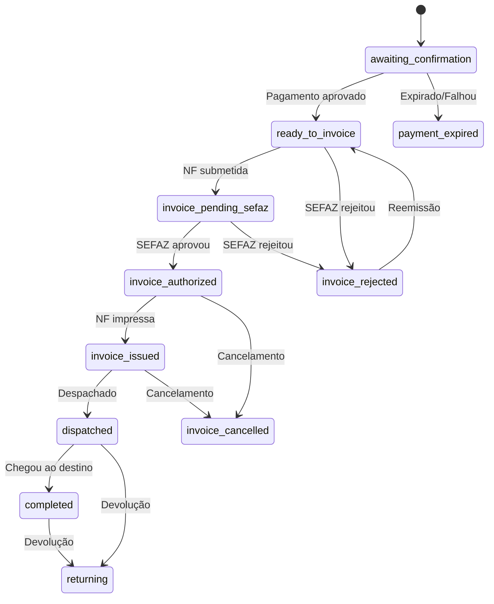
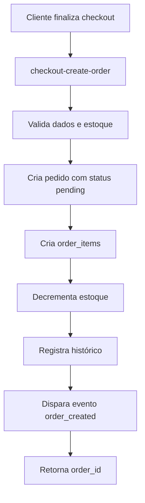
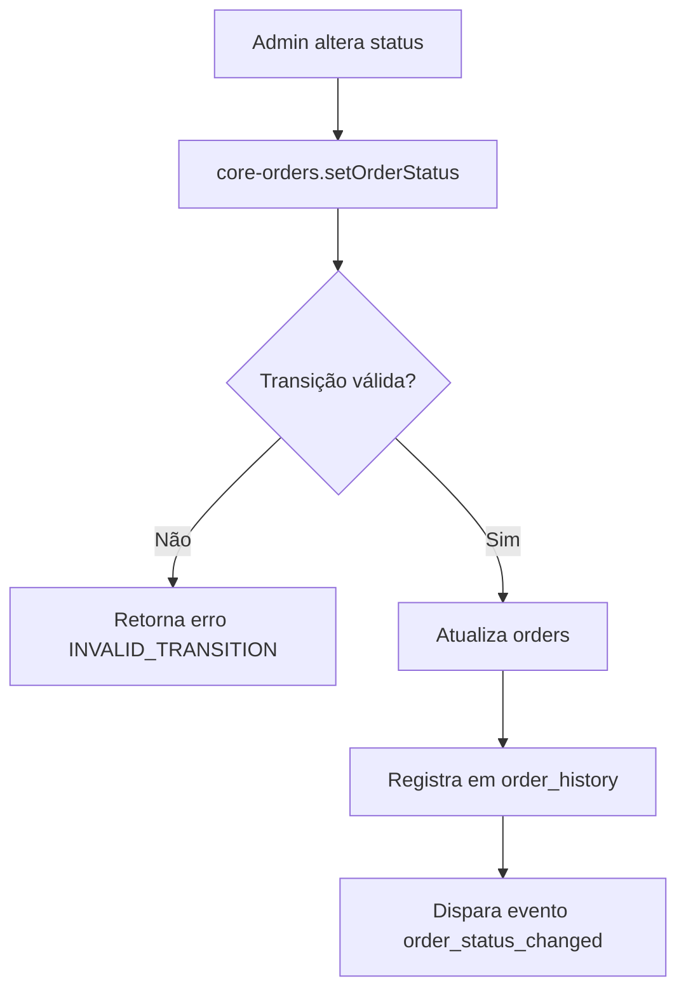

# Módulo: Pedidos (Admin)

> **Status:** ✅ Ativo  
> **Camada:** Layer 3 — Especificações / E-commerce  
> **Última atualização:** 2026-04-03  
> **Migrado de:** `docs/regras/pedidos.md`

---

## 1. Visão Geral

O módulo de Pedidos gerencia todo o ciclo de vida de uma venda, desde a criação até a entrega. Implementa uma máquina de estados para status do pedido, pagamento e envio, garantindo transições válidas. Todas as operações passam pela Edge Function `core-orders` para auditoria e consistência.

---

## 2. Arquitetura de Componentes

### 2.1 Páginas

| Arquivo | Responsabilidade |
|---------|------------------|
| `src/pages/Orders.tsx` | Lista de pedidos com filtros, estatísticas e paginação |
| `src/pages/OrderDetail.tsx` | Detalhes do pedido, itens, histórico, notas, rastreio |
| `src/pages/OrderNew.tsx` | Criação manual de pedidos |

### 2.2 Componentes

| Arquivo | Responsabilidade |
|---------|------------------|
| `OrderList.tsx` | Tabela com badges de status e ações |
| `OrderSourceBadge.tsx` | Badge de origem (Loja, ML, Shopee) |
| `OrderShippingMethod.tsx` | Método de envio |
| `ShipmentSection.tsx` | Rastreio e envio |
| `PaymentAttemptsCard.tsx` | Histórico de tentativas de pagamento |

### 2.3 Hooks

| Arquivo | Responsabilidade |
|---------|------------------|
| `useOrders.ts` | Lista, cria, atualiza status, deleta via coreOrdersApi |
| `useOrderDetails.ts` | Busca pedido por ID/número via Edge Function |
| `useCustomerOrders.ts` | Pedidos do cliente logado (storefront) |
| `usePaymentTransactions.ts` | Tentativas de pagamento por order_id |
| `useRetryLinkedOrder.ts` | Vínculo bidirecional de retry |

### 2.4 Edge Functions

| Função | Responsabilidade |
|--------|------------------|
| `core-orders` | API canônica: createOrder, setOrderStatus, setPaymentStatus, setShippingStatus, addNote, updateTracking, deleteOrder |
| `get-order` | Busca segura (bypassa RLS para guest). Aceita com/sem `#`, normaliza. Ordena `created_at DESC LIMIT 1` para duplicatas |
| `checkout-create-order` | Criação de pedido via checkout do storefront |
| `shipment-ingest` | Ingestão de dados de envio/rastreio |
| `expire-stale-orders` | Cancela pedidos expirados (cron 15min) |

---

## 3. Modelo de Dados

### 3.1 Tabela `orders`

```typescript
interface Order {
  id: string;                    // UUID PK
  tenant_id: string;             // FK → tenants
  customer_id: string | null;    // FK → customers
  order_number: string;          // Sequencial por tenant (#XXXX)
  
  // === Status ===
  status: OrderStatus;
  payment_status: PaymentStatus;
  shipping_status: ShippingStatus;
  
  // === Valores ===
  subtotal: number;
  discount_total: number;
  shipping_total: number;
  tax_total: number;
  total: number;                 // subtotal - discount + shipping + tax
  
  // === Pagamento ===
  payment_method: PaymentMethod | null;
  payment_gateway: string | null;
  payment_gateway_id: string | null;
  paid_at: string | null;
  installments: number | null;
  installment_value: number | null;
  
  // === Primeira Compra ===
  is_first_sale: boolean;        // Imutável. true = email novo no tenant + pagamento aprovado
  
  // === Envio ===
  shipping_carrier: string | null;
  shipping_service_code: string | null;
  shipping_service_name: string | null;
  shipping_estimated_days: number | null;
  tracking_code: string | null;
  tracking_url: string | null;
  shipped_at: string | null;
  delivered_at: string | null;
  
  // === Cliente (snapshot) ===
  customer_name: string;
  customer_email: string;        // Normalizado (lowercase, trim)
  customer_phone: string | null;
  customer_cpf: string | null;
  
  // === Endereço de Entrega ===
  shipping_street: string | null;
  shipping_number: string | null;
  shipping_complement: string | null;
  shipping_neighborhood: string | null;
  shipping_city: string | null;
  shipping_state: string | null;
  shipping_postal_code: string | null;
  shipping_country: string | null;
  
  // === Endereço de Cobrança ===
  billing_street: string | null;
  billing_number: string | null;
  billing_complement: string | null;
  billing_neighborhood: string | null;
  billing_city: string | null;
  billing_state: string | null;
  billing_postal_code: string | null;
  billing_country: string | null;
  
  // === Notas ===
  customer_notes: string | null;  // Observações do cliente
  internal_notes: string | null;  // Notas internas (não visíveis ao cliente)
  
  // === Cancelamento ===
  cancelled_at: string | null;
  cancellation_reason: string | null;
  
  // === Marketplace ===
  source_order_number: string | null;
  source_platform: string | null;
  marketplace_source: string | null;
  marketplace_order_id: string | null;
  marketplace_data: Record<string, unknown> | null;
  
  // === Metadados ===
  currency: string | null;       // Default: BRL
  fx_rate: number | null;
  source_hash: string | null;    // Para deduplicação
  gateway_payload: Record<string, unknown> | null;
  
  // === Retry ===
  retry_from_order_id: string | null;
  retry_token: string | null;
  retry_token_expires_at: string | null;
  
  // === Auditoria ===
  canonical_total: number | null;
  checkout_attempt_id: string | null;  // UUID — idempotência
  
  created_at: string;
  updated_at: string;
}
```

### 3.1.1 Regra de Pedidos Fantasma (Ghost Orders) — REGRA CRÍTICA

| Campo | Valor |
|-------|-------|
| **Descrição** | Pedidos sem `payment_gateway_id` são considerados "fantasmas" e ficam ocultos |
| **Filtro canônico** | `.not('payment_gateway_id', 'is', null)` — obrigatório em TODAS as queries |
| **Cron** | `expire-stale-orders` cancela após 30min, emite `order.ghost_cancelled`. NÃO marca checkout_session como abandoned |

**Garantia tripla de gravação do `payment_gateway_id`:**

| Ponto | Função | Quando grava |
|-------|--------|--------------|
| 1. Função de cobrança (primário) | `pagarme-create-charge`, `mercadopago-create-charge`, `pagbank-create-charge` | Ao receber resposta da operadora (QUALQUER status: paid, pending, failed) |
| 2. Webhook (redundância) | `pagarme-webhook`, `mercadopago-storefront-webhook` | Em toda notificação de pagamento |
| 3. Importação | `import-orders` | Ao importar de outras plataformas |

**REGRA:** O `payment_gateway_id` é gravado independente do status do pagamento. Se a operadora respondeu (com sucesso ou recusa), o pedido é real.

**Checklist para novas queries:**
- [ ] Usa `.not('payment_gateway_id', 'is', null)`?
- [ ] Aplica em TODAS as queries do mesmo hook (lista, stats, contagem)?

**Pontos de uso do filtro:**

| Ponto de uso | Filtro |
|-------|---------------|
| Admin (`useOrders.ts`) | `.not('payment_gateway_id', 'is', null)` |
| Admin (`usePayments.ts`) | `.not('payment_gateway_id', 'is', null)` |
| Admin (`useDashboardMetrics.ts`) | `.not('payment_gateway_id', 'is', null)` |
| Storefront (`useCustomerOrders.ts`) | `.not('payment_gateway_id', 'is', null)` |
| Cron (`expire-stale-orders`) | `.is('payment_gateway_id', null)` + `payment_status = pending` → cancela |

**Fluxo do ghost order:**
1. Cliente inicia checkout → pedido criado (sem `payment_gateway_id`)
2. Função de cobrança → grava `payment_gateway_id` (mesmo se recusado)
3. Webhook confirma → regrava como redundância
4. Se nenhum gravou → fantasma → cron cancela em 30min

---

### 3.2 Tipos de Status

#### Status do Pedido

```typescript
type OrderStatus = 
  | 'awaiting_confirmation'    // Aguardando confirmação
  | 'ready_to_invoice'         // Pronto para emitir NF
  | 'invoice_pending_sefaz'    // Pendente SEFAZ
  | 'invoice_authorized'       // NF Autorizada
  | 'invoice_issued'           // NF Emitida
  | 'dispatched'               // Despachado
  | 'completed'                // Concluído
  | 'returning'                // Em devolução
  | 'payment_expired'          // Pagamento expirado
  | 'invoice_rejected'         // NF Rejeitada
  | 'invoice_cancelled';       // NF Cancelada
```

#### Status de Pagamento

```typescript
type PaymentStatus = 
  | 'awaiting_payment'  // Aguardando
  | 'paid'              // Pago
  | 'declined'          // Recusado
  | 'cancelled'         // Cancelado
  | 'refunded';         // Estornado
```

#### Status de Envio

```typescript
type ShippingStatus = 
  | 'awaiting_shipment' | 'label_generated' | 'shipped'
  | 'in_transit' | 'arriving' | 'delivered'
  | 'problem' | 'awaiting_pickup' | 'returning' | 'returned';
```

### 3.3 Tabela `order_items`

```typescript
interface OrderItem {
  id: string;
  order_id: string;
  product_id: string | null;
  variant_id: string | null;
  sku: string;
  product_name: string;
  variant_name: string | null;
  product_slug: string | null;
  product_image_url: string | null;
  quantity: number;
  unit_price: number;
  discount_amount: number;
  total_price: number;           // (unit_price * quantity) - discount
  weight: number | null;
  tax_amount: number | null;
  cost_price: number | null;
  barcode: string | null;
  ncm: string | null;
  tenant_id: string | null;
  created_at: string;
}
```

### 3.4 Tabela `order_history`

```typescript
interface OrderHistory {
  id: string;
  order_id: string;
  author_id: string | null;
  action: string;                // "status_change", "note_added"
  previous_value: Record<string, unknown> | null;
  new_value: Record<string, unknown> | null;
  description: string | null;
  created_at: string;
}
```

---

## 4. Máquina de Estados

### 4.1 Transições de Status do Pedido



### 4.2 Transições de Pagamento

| De | Para | Válido |
|----|------|--------|
| `awaiting_payment` | `paid`, `declined`, `cancelled` | ✅ |
| `paid` | `refunded` | ✅ |
| `declined` | `awaiting_payment`, `cancelled` | ✅ |
| `cancelled` | - | ❌ (final) |
| `refunded` | - | ❌ (final) |

### 4.3 Transições de Envio

| De | Para | Válido |
|----|------|--------|
| `awaiting_shipment` | `label_generated`, `problem` | ✅ |
| `label_generated` | `shipped`, `problem` | ✅ |
| `shipped` | `in_transit`, `problem` | ✅ |
| `in_transit` | `arriving`, `delivered`, `problem`, `awaiting_pickup` | ✅ |
| `arriving` | `delivered`, `problem` | ✅ |
| `delivered` | `returning` | ✅ |
| `problem` | `awaiting_shipment`, `returning`, `returned` | ✅ |
| `awaiting_pickup` | `delivered`, `returning` | ✅ |
| `returning` | `returned` | ✅ |
| `returned` | - | ❌ (final) |

### 4.4 Transições Automáticas

| Evento | De | Para | Mecanismo |
|--------|----|------|-----------|
| Webhook pagamento aprovado | `awaiting_confirmation` | `ready_to_invoice` | `pagarme-webhook` / `reconcile-payments` |
| PIX/Boleto expirado | `awaiting_confirmation` | `payment_expired` | `expire-stale-orders` (cron) |
| Pagamento recusado | `awaiting_confirmation` | `payment_expired` | `expire-stale-orders` (cron) |

### 4.5 Normalização de Status (ANTI-REGRESSÃO)

Todo lookup de status na UI **DEVE** usar funções de normalização:

```typescript
// ✅ CORRETO
const normalizedStatus = normalizeOrderStatus(order.status);
const cfg = ORDER_STATUS_CONFIG[normalizedStatus];

// ❌ PROIBIDO
const cfg = ORDER_STATUS_CONFIG[order.status as OrderStatus] || ORDER_STATUS_CONFIG.awaiting_confirmation;
```

| Função | Mapeia |
|--------|--------|
| `normalizeOrderStatus()` | `pending→awaiting_confirmation`, `paid→ready_to_invoice`, `cancelled→payment_expired`, `delivered→completed` |
| `normalizePaymentStatus()` | `approved→paid`, `pending→awaiting_payment` |
| `normalizeShippingStatus()` | `pending→awaiting_shipment`, `processing→label_generated` |

---

## 5. Fluxos de Negócio

### 5.1 Criação via Checkout



### 5.2 Atualização de Status



### 5.3 Rastreio

1. Admin adiciona código via `updateTracking`
2. `shipment-ingest` cria registro de envio
3. Cron `tracking-poll` consulta transportadora
4. Atualizações refletem em `shipping_status`

---

## 6. UI/UX

### 6.1 Lista de Pedidos

| Coluna | Largura | Conteúdo |
|--------|---------|----------|
| Pedido | 100px | OrderSourceBadge (sm) + número (font-semibold) |
| Cliente | min 180px | Nome (truncate 200px) + email (xs, truncate) |
| Status | 140px | Badge com ícone + label (text-xs, whitespace-nowrap) |
| Envio | 120px | Badge com ícone + tooltip (transportadora + rastreio) |
| Método | 90px | Label curta: PIX, Cartão, Boleto (text-xs font-medium) |
| Pagamento | 120px | Badge de status (text-xs, whitespace-nowrap) |
| Total | 110px, right | Valor (font-semibold) + badge "1ª" se first_sale |
| Data | 130px | dd/mm/yyyy hh:mm (text-xs) |
| Ações | 40px | Dropdown (ver, alterar status, excluir) |

| Elemento | Comportamento |
|----------|---------------|
| Busca | Por número, nome ou email |
| Filtros | Status, pagamento, envio, 1ª Venda. Período via `DateRangeFilter` |
| Estatísticas | 4 cards: Total, Aprovados, NF Emitida, Enviados — queries separadas com filtros ativos |
| 1ª Venda | Badge "1ª" ao lado do valor + toggle de filtro |
| Paginação | 50 por página |

### 6.1.1 Flag "1ª Venda"

- `orders.is_first_sale` (boolean, imutável) — definido na criação quando email é novo no tenant
- Gravado por: `checkout-create-order`, `core-orders`, `import-orders`, `admin-create-test-order`
- Consumido diretamente do banco (sem cálculo no frontend)
- Badge verde "1ª" em `OrderList.tsx` ao lado do valor
- Filtro toggle em `Orders.tsx`
- Desacoplado de `customers.total_orders`
- Ghost orders podem ter `is_first_sale = true`, mas ficam ocultos
- Pedidos importados: `is_first_sale = false` por padrão

### 6.2 Detalhes do Pedido

| Seção | Conteúdo |
|-------|----------|
| Cabeçalho | Número, data, badges de status |
| Cliente | Nome, email, telefone, link para perfil |
| Itens | Lista com imagem, nome, quantidade, valor |
| Valores | Subtotal, desconto, frete, total |
| Endereço | Entrega e cobrança |
| Pagamento | Método, gateway, data, código operadora |
| Tentativas | Histórico de `payment_transactions` |
| Envio | Transportadora, rastreio, timeline |
| Histórico | Todas as alterações com timestamp e autor |
| Notas | Internas (admin) e do cliente |

### 6.2.1 Card: Tentativas de Pagamento

| Campo | Valor |
|-------|-------|
| Componente | `PaymentAttemptsCard.tsx` |
| Hook | `usePaymentTransactions.ts` |
| Descrição | Log de tentativas com: status, badge, data, método, operadora, valor (dividido por 100 — centavos), código da transação (monospace), mensagem de erro |
| Condições | Só renderiza se há ≥ 1 tentativa |
| Ordenação | Data descendente |

### 6.3 Retry (Retentativa de Pagamento)

- Banner azul: "Este pedido foi criado como retentativa do pedido #X"
- Banner amarelo: "Este pedido foi substituído pelo pedido #Y"
- Hook: `useRetryLinkedOrder.ts` — busca bidirecional
- Ícone `Link2` (text-info) na lista quando `retry_from_order_id` existe
- Tooltip: "Retentativa de pagamento"

### 6.4 Stat Card "Recusados"

- Página Pagamentos: card com `declinedCount` e `declinedTotal`
- Variante `destructive`, ícone `XCircle`
- Conta apenas pedidos do mês com `payment_gateway_id` (sem ghost orders)

### 6.5 Integridade do GMV

GMV filtra apenas `payment_status = 'approved'` — declined e substituídos NÃO entram.

---

## 7. Ciclo de Vida Automatizado

### 7.1 Expiração Automática (cron: `expire-stale-orders-every-15m`)

| Tipo | Prazo | Ação |
|------|-------|------|
| PIX pendente | 1 hora | `status=cancelled`, `payment_status=cancelled` |
| Boleto pendente | 4 dias | `status=cancelled`, `payment_status=cancelled` |
| Pedido órfão (sem transação) | 30 min | `status=cancelled` |
| `payment_status=declined` + `status=pending` | Imediato | `status=cancelled` |

### 7.2 Registro em `order_history`

Mudanças por webhook e cron registradas automaticamente:
- `action`: `status_changed` ou `payment_status_changed`
- `description`: inclui origem (ex: "webhook Pagar.me", "PIX expirado (automático)")

---

## 8. Regras de Negócio

### 8.1 Numeração

- Formato: `#XXXX` (sequencial por tenant)
- Campo `next_order_number` na tabela `tenants`
- Default para novos tenants: 1
- Nunca reutilizado
- Após importação: `next_order_number` = MAX + 1

### 8.2 Exclusão

- Apenas `pending` ou `cancelled` podem ser excluídos
- Pedidos pagos/processados: cancelar, não excluir
- `core-orders.deleteOrder` valida regras

### 8.3 Estoque

- Decrementado na criação do pedido
- Revertido em cancelamento (se configurado)
- Não revertido em devolução (gestão manual)

### 8.4 Métodos de Pagamento

```typescript
type PaymentMethod = 'pix' | 'credit_card' | 'debit_card' | 'boleto' | 'mercado_pago' | 'pagarme';
```

### 8.5 Origens

| Origem | Descrição |
|--------|-----------|
| `null` | Loja própria (storefront) |
| `mercadolivre` | Mercado Livre |
| `shopee` | Shopee |
| `amazon` | Amazon |
| `magazineluiza` | Magazine Luiza |

---

## 9. Integração com Outros Módulos

| Módulo | Integração |
|--------|------------|
| Clientes | Vínculo por `customer_email` |
| Produtos | Items referenciam `product_id` |
| Descontos | `discount_total` e cupom |
| Fiscal | Geração de NF-e a partir do pedido |
| Notificações | Emails transacionais |
| Marketplaces | Sincronização (ML, Shopee) |
| Afiliados | Comissão calculada |

---

## 10. Regras Visuais — Responsividade Mobile

| Elemento | Comportamento Mobile | Arquivo |
|----------|---------------------|---------|
| Tabela de pedidos | `overflow-x-auto` com `min-w-[900px]` | `OrderList.tsx` |
| Filtros | `w-full sm:w-44` | `Orders.tsx` |
| Container filtros | `flex-wrap w-full sm:w-auto` | `Orders.tsx` |
| Paginação | Botões numéricos ocultos (`hidden sm:flex`), apenas Anterior/Próximo | `Orders.tsx` |
| Texto paginação | `text-center sm:text-left` | `Orders.tsx` |
| Container paginação | `flex-col gap-3 sm:flex-row` | `Orders.tsx` |

---

## 11. Permissões (RBAC)

| Rota | Módulo | Submódulo |
|------|--------|-----------|
| `/orders` | `ecommerce` | `orders` |
| `/orders/:id` | `ecommerce` | `orders` |
| `/orders/new` | `ecommerce` | `orders` |

---

## 12. Arquivos Relacionados

- `src/pages/Orders.tsx`, `OrderDetail.tsx`, `OrderNew.tsx`
- `src/components/orders/*`
- `src/hooks/useOrders.ts`, `useOrderDetails.ts`, `usePaymentTransactions.ts`, `useRetryLinkedOrder.ts`
- `src/types/orderStatus.ts`
- `src/lib/coreApi.ts` (coreOrdersApi)
- `supabase/functions/core-orders/`
- `supabase/functions/get-order/`
- `supabase/functions/checkout-create-order/`
- `supabase/functions/pagarme-webhook/`
- `supabase/functions/expire-stale-orders/`

---

## 13. Pendências

- [ ] Exportação de pedidos (CSV/Excel)
- [ ] Impressão de etiqueta integrada
- [ ] Split de pedido (múltiplos envios)
- [ ] Edição de itens após criação
- [ ] Reembolso parcial

---

*Fim do documento.*
