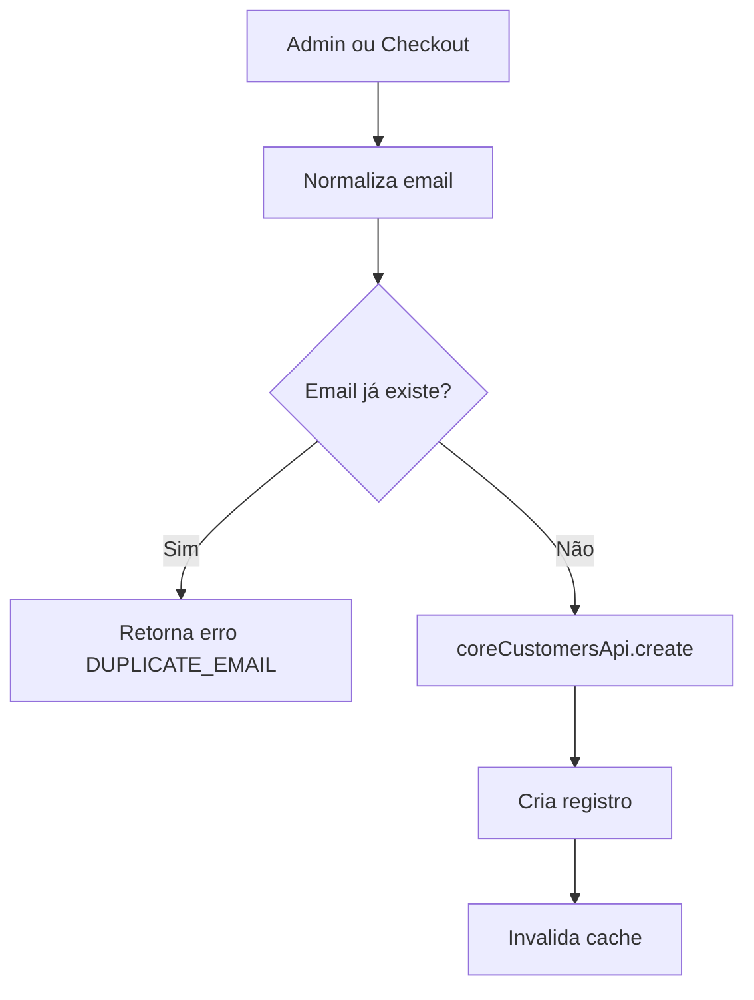

# Módulo: Clientes (Admin)

> **Status**: ✅ Funcional e Protegido  
> **Última atualização**: 2025-01-19

---

## 1. Visão Geral

O módulo de Clientes é um CRM integrado ao e-commerce, permitindo gerenciar a base de clientes com segmentação por tags, múltiplos endereços, histórico de compras e notas internas. A identidade do cliente é baseada exclusivamente no **email** (normalizado), não no CPF ou auth.uid().

---

## 2. Arquitetura de Componentes

### 2.1 Páginas

| Arquivo | Responsabilidade |
|---------|------------------|
| `src/pages/Customers.tsx` | Lista de clientes com busca, filtros, tags e paginação |
| `src/pages/CustomerDetail.tsx` | Perfil completo do cliente com abas |
| `src/pages/CustomerNew.tsx` | Criação de novo cliente |

### 2.2 Componentes

| Arquivo | Responsabilidade |
|---------|------------------|
| `src/components/customers/CustomerList.tsx` | Tabela de clientes com status, tier e ações |
| `src/components/customers/CustomerForm.tsx` | Formulário completo de criação/edição |
| `src/components/customers/CustomerAddressForm.tsx` | Formulário de endereço |
| `src/components/customers/CustomerTagsManager.tsx` | Gerenciador de tags (CRUD) |
| `src/components/customers/CustomerImport.tsx` | Importação em lote (CSV) |
| `src/components/customers/CustomerInfoPanel.tsx` | Painel resumo (usado no suporte) |

### 2.3 Hooks

| Arquivo | Responsabilidade |
|---------|------------------|
| `src/hooks/useCustomers.ts` | CRUD de clientes via coreCustomersApi |
| `src/hooks/useCustomerOrders.ts` | Pedidos do cliente (por email) |

### 2.4 Edge Functions

| Função | Responsabilidade |
|--------|------------------|
| `core-customers` | API canônica: create, update, delete, addAddress, updateTags, addNote |
| `import-customers` | Importação em lote de clientes |
| `assign-tag-to-all-customers` | Atribuição de tag em massa |

---

## 3. Modelo de Dados

### 3.1 Tabela `customers`

```typescript
interface Customer {
  id: string;                    // UUID PK
  tenant_id: string;             // FK → tenants
  auth_user_id: string | null;   // FK → auth.users (se tiver conta)
  
  // === Identificação ===
  email: string;                 // ÚNICO por tenant (normalizado)
  full_name: string;
  cpf: string | null;            // Opcional, apenas fiscal
  phone: string | null;
  birth_date: string | null;
  gender: 'male' | 'female' | 'other' | 'not_informed' | null;
  
  // === Pessoa Jurídica ===
  person_type: 'pf' | 'pj' | null;
  cnpj: string | null;
  company_name: string | null;
  ie: string | null;             // Inscrição Estadual
  state_registration_is_exempt: boolean | null;
  rg: string | null;
  
  // === Status ===
  status: 'active' | 'inactive' | 'blocked' | null;
  email_verified: boolean | null;
  phone_verified: boolean | null;
  
  // === Marketing ===
  accepts_marketing: boolean | null;  // Legacy, geral
  accepts_email_marketing: boolean | null;
  accepts_sms_marketing: boolean | null;
  accepts_whatsapp_marketing: boolean | null;
  unsubscribed_at: string | null;
  bounced_at: string | null;
  
  // === Métricas (calculadas) ===
  total_orders: number | null;
  total_spent: number | null;
  average_ticket: number | null;
  first_order_at: string | null;
  last_order_at: string | null;
  
  // === Fidelidade ===
  loyalty_points: number | null;
  loyalty_tier: 'bronze' | 'silver' | 'gold' | 'platinum' | null;
  
  // === Origem ===
  last_source_platform: string | null;
  last_external_id: string | null;
  
  // === Notas ===
  notes: string | null;          // Campo de texto livre
  
  created_at: string;
  updated_at: string;
}
```

### 3.2 Tabela `customer_addresses`

```typescript
interface CustomerAddress {
  id: string;
  customer_id: string;           // FK → customers
  label: string;                 // Ex: "Casa", "Trabalho"
  is_default: boolean;
  recipient_name: string;
  recipient_cpf: string | null;
  recipient_phone: string | null;
  street: string;
  number: string;
  complement: string | null;
  neighborhood: string;
  city: string;
  state: string;                 // 2 caracteres (UF)
  postal_code: string;
  country: string;               // Default: "BR"
  reference: string | null;      // Ponto de referência
  ibge_code: string | null;
  address_type: 'residential' | 'commercial' | 'other' | null;
  created_at: string;
  updated_at: string;
}
```

### 3.3 Tabela `customer_tags`

```typescript
interface CustomerTag {
  id: string;
  tenant_id: string;
  name: string;                  // Único por tenant
  color: string;                 // Hex color
  description: string | null;
  created_at: string;
}
```

### 3.4 Tabela `customer_tag_assignments`

```typescript
interface CustomerTagAssignment {
  id: string;
  customer_id: string;
  tag_id: string;
  created_at: string;
}
```

### 3.5 Tabela `customer_notes`

```typescript
interface CustomerNote {
  id: string;
  customer_id: string;
  author_id: string;             // Quem escreveu
  content: string;
  is_pinned: boolean;
  created_at: string;
  updated_at: string;
}
```

---

## 4. Fluxos de Negócio

### 4.1 Identidade por Email

```
REGRA FUNDAMENTAL:
- Cliente é identificado EXCLUSIVAMENTE por email (normalizado: trim().toLowerCase())
- CPF é opcional e usado APENAS para fins fiscais
- auth.uid() não é usado para vincular cliente
- Pedidos persistem com orders.customer_email
- Mesmo cliente com emails diferentes = registros separados (esperado no MVP)
```

### 4.2 Criação de Cliente



### 4.3 Métricas Automáticas

As métricas do cliente são atualizadas automaticamente após cada pedido:

| Campo | Cálculo |
|-------|---------|
| `total_orders` | COUNT(orders) |
| `total_spent` | SUM(orders.total) |
| `average_ticket` | total_spent / total_orders |
| `first_order_at` | MIN(orders.created_at) |
| `last_order_at` | MAX(orders.created_at) |

### 4.4 Tiers de Fidelidade

| Tier | Critério Sugerido |
|------|-------------------|
| Bronze | Padrão inicial |
| Silver | 5+ pedidos ou R$1.000+ gastos |
| Gold | 15+ pedidos ou R$5.000+ gastos |
| Platinum | 30+ pedidos ou R$15.000+ gastos |

> **Nota**: A progressão de tiers não está implementada automaticamente no MVP.

---

## 5. UI/UX

### 5.1 Lista de Clientes

| Elemento | Comportamento |
|----------|---------------|
| Busca | Por nome, email, telefone |
| Filtros | Status (ativo, inativo, bloqueado) |
| Tags | Botão para gerenciar tags |
| Estatísticas | Total de clientes, novos no mês |
| Importação | Upload de CSV |
| Ações | Ver, Editar, Excluir |
| Paginação | 50 por página |

### 5.2 Detalhes do Cliente

| Seção | Conteúdo |
|-------|----------|
| **Cabeçalho** | Avatar, nome, badges (status, tier) |
| **Dados Pessoais** | Email, telefone, CPF, nascimento |
| **Empresa** | CNPJ, razão social, IE (se PJ) |
| **Métricas** | Pedidos, total gasto, ticket médio |
| **Endereços** | Lista com ações (editar, excluir, definir padrão) |
| **Tags** | Tags atribuídas, adicionar/remover |
| **Notas** | Notas internas com autor e data |
| **Histórico** | Lista de pedidos recentes |

### 5.3 Abas na Página de Detalhe

| Aba | Conteúdo |
|-----|----------|
| **Perfil** | Dados cadastrais editáveis |
| **Pedidos** | Histórico de compras |
| **Endereços** | Gerenciamento de endereços |
| **Notificações** | Histórico de comunicações |

---

## 6. Segmentação com Tags

### 6.1 Uso de Tags

- Organização de clientes em grupos
- Filtro em campanhas de email marketing
- Regras de desconto por segmento
- Atendimento personalizado

### 6.2 Cores Disponíveis

```typescript
const colorOptions = [
  '#6366f1', // Indigo
  '#8b5cf6', // Violet
  '#ec4899', // Pink
  '#ef4444', // Red
  '#f97316', // Orange
  '#eab308', // Yellow
  '#22c55e', // Green
  '#14b8a6', // Teal
  '#06b6d4', // Cyan
  '#3b82f6', // Blue
];
```

---

## 7. Importação de Clientes

### 7.1 Formato CSV

```csv
email,full_name,phone,cpf,status
cliente@email.com,João Silva,11999999999,12345678900,active
```

### 7.2 Campos Suportados

| Campo | Obrigatório | Mapeamento |
|-------|-------------|------------|
| email | ✅ | `email` |
| full_name / name | ✅ | `full_name` |
| phone | ❌ | `phone` |
| cpf | ❌ | `cpf` |
| status | ❌ | `status` (default: active) |

### 7.3 Comportamento

- Emails duplicados são ignorados (não sobrescrevem)
- Relatório ao final com importados/ignorados/erros

---

## 8. Integração com Outros Módulos

| Módulo | Integração |
|--------|------------|
| **Pedidos** | Vínculo por `customer_email` |
| **Checkout** | Auto-criação de cliente se não existe |
| **Email Marketing** | Segmentação por tags e consentimento |
| **Suporte** | Painel de informações do cliente |
| **Descontos** | Cupons de primeira compra |
| **Notificações** | Comunicações transacionais |

---

## 9. Consentimentos de Marketing

| Campo | Uso |
|-------|-----|
| `accepts_marketing` | Consentimento geral (legacy) |
| `accepts_email_marketing` | Específico para email |
| `accepts_sms_marketing` | Específico para SMS |
| `accepts_whatsapp_marketing` | Específico para WhatsApp |
| `unsubscribed_at` | Data de opt-out |
| `bounced_at` | Data de bounce de email |

---

## 10. Regras de Negócio

### 10.1 Validações

| Campo | Regra |
|-------|-------|
| `email` | Obrigatório, formato válido, único por tenant |
| `full_name` | Obrigatório, min 2 caracteres |
| `cpf` | Opcional, formato válido se informado |
| `phone` | Opcional, formato válido se informado |

### 10.2 Exclusão

- Clientes com pedidos: soft delete (`status = 'inactive'`)
- `coreCustomersApi.checkDependencies` verifica vínculos
- Dependências verificadas: pedidos, conversas, endereços, notas, tags

---

## 11. Permissões (RBAC)

| Rota | Módulo | Submódulo |
|------|--------|-----------|
| `/customers` | `ecommerce` | `customers` |
| `/customers/:id` | `ecommerce` | `customers` |
| `/customers/new` | `ecommerce` | `customers` |

---

## 12. Arquivos Relacionados

- `src/pages/Customers.tsx`
- `src/pages/CustomerDetail.tsx`
- `src/components/customers/*`
- `src/hooks/useCustomers.ts`
- `src/hooks/useCustomerOrders.ts`
- `src/lib/coreApi.ts` (coreCustomersApi)
- `src/lib/normalizeEmail.ts`
- `supabase/functions/core-customers/`
- `supabase/functions/import-customers/`

---

## 13. Pendências

- [ ] Exportação de clientes (CSV/Excel)
- [ ] Merge de clientes duplicados
- [ ] Progressão automática de tier
- [ ] Histórico de alterações do perfil
- [ ] Validação de telefone (SMS)
- [ ] Integração com sistemas de fidelidade externos
