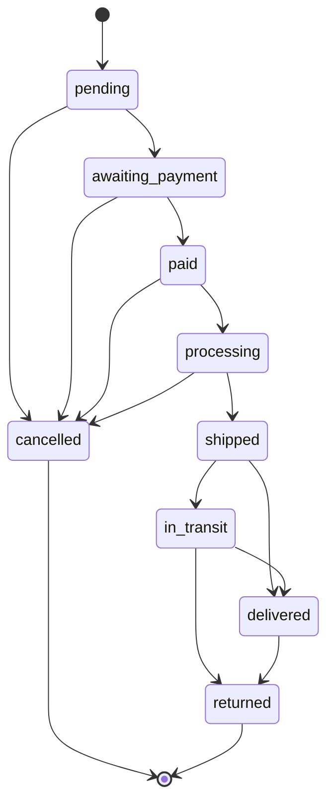
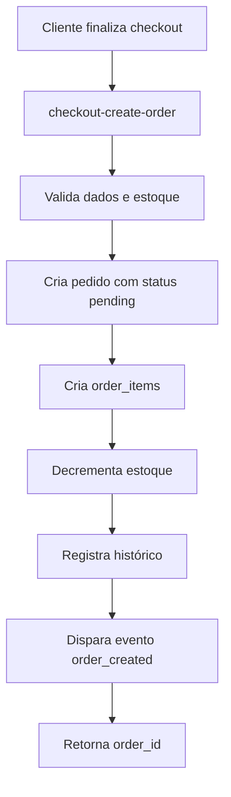
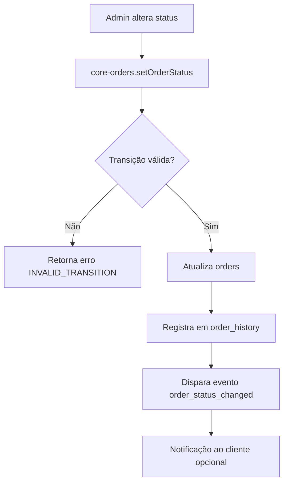

# Módulo: Pedidos (Admin)

> **Status**: ✅ Funcional e Protegido  
> **Última atualização**: 2025-01-19

---

## 1. Visão Geral

O módulo de Pedidos gerencia todo o ciclo de vida de uma venda, desde a criação até a entrega. Implementa uma máquina de estados para status do pedido, pagamento e envio, garantindo transições válidas. Todas as operações passam pela Edge Function `core-orders` para auditoria e consistência.

---

## 2. Arquitetura de Componentes

### 2.1 Páginas

| Arquivo | Responsabilidade |
|---------|------------------|
| `src/pages/Orders.tsx` | Lista de pedidos com filtros, estatísticas e paginação |
| `src/pages/OrderDetail.tsx` | Detalhes do pedido, itens, histórico, notas, rastreio |
| `src/pages/OrderNew.tsx` | Criação manual de pedidos |

### 2.2 Componentes

| Arquivo | Responsabilidade |
|---------|------------------|
| `src/components/orders/OrderList.tsx` | Tabela de pedidos com badges de status e ações |
| `src/components/orders/OrderSourceBadge.tsx` | Badge de origem (Loja, Mercado Livre, Shopee) |
| `src/components/orders/OrderShippingMethod.tsx` | Exibição do método de envio |
| `src/components/orders/ShipmentSection.tsx` | Seção de rastreio e envio |

### 2.3 Hooks

| Arquivo | Responsabilidade |
|---------|------------------|
| `src/hooks/useOrders.ts` | Lista, cria, atualiza status, deleta pedidos via coreOrdersApi |
| `src/hooks/useOrderDetails.ts` | Busca pedido por ID/número via Edge Function |
| `src/hooks/useCustomerOrders.ts` | Pedidos do cliente logado (storefront) |

### 2.4 Edge Functions

| Função | Responsabilidade |
|--------|------------------|
| `core-orders` | API canônica: createOrder, setOrderStatus, setPaymentStatus, setShippingStatus, addNote, updateTracking, deleteOrder |
| `get-order` | Busca segura de pedido (bypassa RLS para guest) |
| `checkout-create-order` | Criação de pedido via checkout do storefront |
| `shipment-ingest` | Ingestão de dados de envio/rastreio |

---

## 3. Modelo de Dados

### 3.1 Tabela `orders`

```typescript
interface Order {
  id: string;                    // UUID PK
  tenant_id: string;             // FK → tenants
  customer_id: string | null;    // FK → customers (opcional)
  order_number: string;          // Sequencial por tenant (ex: "ORD-0001")
  
  // === Status ===
  status: OrderStatus;
  payment_status: PaymentStatus;
  shipping_status: ShippingStatus;
  
  // === Valores ===
  subtotal: number;              // Soma dos itens
  discount_total: number;        // Descontos aplicados
  shipping_total: number;        // Frete
  tax_total: number;             // Impostos
  total: number;                 // subtotal - discount + shipping + tax
  
  // === Pagamento ===
  payment_method: PaymentMethod | null;
  payment_gateway: string | null;
  payment_gateway_id: string | null;
  paid_at: string | null;
  installments: number | null;
  installment_value: number | null;
  
  // === Envio ===
  shipping_carrier: string | null;
  shipping_service_code: string | null;
  shipping_service_name: string | null;
  shipping_estimated_days: number | null;
  tracking_code: string | null;
  tracking_url: string | null;
  shipped_at: string | null;
  delivered_at: string | null;
  
  // === Cliente ===
  customer_name: string;
  customer_email: string;        // Normalizado (lowercase, trim)
  customer_phone: string | null;
  customer_cpf: string | null;
  
  // === Endereço de Entrega ===
  shipping_street: string | null;
  shipping_number: string | null;
  shipping_complement: string | null;
  shipping_neighborhood: string | null;
  shipping_city: string | null;
  shipping_state: string | null;
  shipping_postal_code: string | null;
  shipping_country: string | null;
  
  // === Endereço de Cobrança ===
  billing_street: string | null;
  billing_number: string | null;
  billing_complement: string | null;
  billing_neighborhood: string | null;
  billing_city: string | null;
  billing_state: string | null;
  billing_postal_code: string | null;
  billing_country: string | null;
  
  // === Notas ===
  customer_notes: string | null;  // Observações do cliente
  internal_notes: string | null;  // Notas internas (não visíveis ao cliente)
  
  // === Cancelamento ===
  cancelled_at: string | null;
  cancellation_reason: string | null;
  
  // === Marketplace ===
  source_order_number: string | null;
  source_platform: string | null;
  marketplace_source: string | null;
  marketplace_order_id: string | null;
  marketplace_data: Record<string, unknown> | null;
  
  // === Metadados ===
  currency: string | null;       // Default: BRL
  fx_rate: number | null;
  source_hash: string | null;    // Para deduplicação
  gateway_payload: Record<string, unknown> | null;
  
  created_at: string;
  updated_at: string;
}
```

### 3.2 Tipos de Status

```typescript
// Status do Pedido
type OrderStatus = 
  | 'pending'           // Aguardando
  | 'awaiting_payment'  // Aguardando pagamento
  | 'paid'              // Pago
  | 'processing'        // Em separação
  | 'shipped'           // Enviado
  | 'in_transit'        // Em trânsito
  | 'delivered'         // Entregue
  | 'cancelled'         // Cancelado
  | 'returned';         // Devolvido

// Status de Pagamento
type PaymentStatus = 
  | 'pending'           // Aguardando
  | 'processing'        // Processando
  | 'approved'          // Aprovado
  | 'declined'          // Recusado
  | 'refunded'          // Reembolsado
  | 'chargeback';       // Chargeback

// Status de Envio
type ShippingStatus = 
  | 'pending'           // Aguardando
  | 'processing'        // Em separação
  | 'shipped'           // Enviado
  | 'in_transit'        // Em trânsito
  | 'out_for_delivery'  // Saiu para entrega
  | 'delivered'         // Entregue
  | 'failed_attempt'    // Tentativa falha
  | 'returned';         // Devolvido
```

### 3.3 Tabela `order_items`

```typescript
interface OrderItem {
  id: string;
  order_id: string;              // FK → orders
  product_id: string | null;     // FK → products (pode ser null se produto deletado)
  variant_id: string | null;     // FK → product_variants
  sku: string;
  product_name: string;
  variant_name: string | null;
  product_slug: string | null;
  product_image_url: string | null;
  quantity: number;
  unit_price: number;
  discount_amount: number;
  total_price: number;           // (unit_price * quantity) - discount
  weight: number | null;
  tax_amount: number | null;
  cost_price: number | null;
  barcode: string | null;
  ncm: string | null;
  tenant_id: string | null;
  created_at: string;
}
```

### 3.4 Tabela `order_history`

```typescript
interface OrderHistory {
  id: string;
  order_id: string;
  author_id: string | null;      // Quem fez a alteração
  action: string;                // Ex: "status_change", "note_added"
  previous_value: Record<string, unknown> | null;
  new_value: Record<string, unknown> | null;
  description: string | null;
  created_at: string;
}
```

---

## 4. Máquina de Estados

### 4.1 Transições de Status do Pedido



### 4.2 Transições de Status de Pagamento

| De | Para | Válido |
|----|------|--------|
| `pending` | `processing`, `approved`, `declined` | ✅ |
| `processing` | `approved`, `declined` | ✅ |
| `approved` | `refunded`, `chargeback` | ✅ |
| `declined` | `pending`, `processing` | ✅ |
| `refunded` | - | ❌ (final) |
| `chargeback` | - | ❌ (final) |

### 4.3 Transições de Status de Envio

| De | Para | Válido |
|----|------|--------|
| `pending` | `processing` | ✅ |
| `processing` | `shipped` | ✅ |
| `shipped` | `in_transit`, `delivered` | ✅ |
| `in_transit` | `out_for_delivery`, `delivered`, `failed_attempt` | ✅ |
| `out_for_delivery` | `delivered`, `failed_attempt` | ✅ |
| `failed_attempt` | `out_for_delivery`, `returned` | ✅ |
| `delivered` | `returned` | ✅ |

---

## 5. Fluxos de Negócio

### 5.1 Criação de Pedido (Checkout)



### 5.2 Atualização de Status



### 5.3 Rastreio

1. Admin adiciona código de rastreio via `updateTracking`
2. Sistema chama `shipment-ingest` para criar registro de envio
3. Cron job `tracking-poll` consulta transportadora periodicamente
4. Atualizações refletem em `shipping_status`

---

## 6. UI/UX

### 6.1 Lista de Pedidos

| Elemento | Comportamento |
|----------|---------------|
| Busca | Por número, nome ou email do cliente |
| Filtros | Status, pagamento, envio, período, data |
| Estatísticas | Cards com pendentes, em separação, enviados |
| Origem | Badge indicando Loja própria ou Marketplace |
| Ações | Ver detalhes, atualizar status, excluir |
| Paginação | 50 por página |

### 6.2 Detalhes do Pedido

| Seção | Conteúdo |
|-------|----------|
| **Cabeçalho** | Número, data, badges de status |
| **Cliente** | Nome, email, telefone, link para perfil |
| **Itens** | Lista com imagem, nome, quantidade, valor |
| **Valores** | Subtotal, desconto, frete, total |
| **Endereço** | Entrega e cobrança |
| **Pagamento** | Método, gateway, data de pagamento |
| **Envio** | Transportadora, código de rastreio, timeline |
| **Histórico** | Todas as alterações com timestamp e autor |
| **Notas** | Internas (admin) e do cliente |

### 6.3 Abas

| Aba | Conteúdo |
|-----|----------|
| **Detalhes** | Informações principais do pedido |
| **Notificações** | Histórico de emails/SMS enviados |

---

## 7. Integração com Outros Módulos

| Módulo | Integração |
|--------|------------|
| **Clientes** | Pedido vinculado por `customer_email` |
| **Produtos** | Itens referenciam `product_id` |
| **Descontos** | `discount_total` e cupom aplicado |
| **Fiscal** | Geração de NF-e a partir do pedido |
| **Notificações** | Emails transacionais automáticos |
| **Marketplaces** | Sincronização com ML, Shopee, etc. |
| **Afiliados** | Comissão calculada a partir do pedido |

---

## 8. Métodos de Pagamento

```typescript
type PaymentMethod = 
  | 'pix'
  | 'credit_card'
  | 'debit_card'
  | 'boleto'
  | 'mercado_pago'
  | 'pagarme';
```

---

## 9. Origens de Pedido

| Origem | Descrição |
|--------|-----------|
| `null` | Loja própria (storefront) |
| `mercadolivre` | Mercado Livre |
| `shopee` | Shopee |
| `amazon` | Amazon |
| `magazineluiza` | Magazine Luiza |

---

## 10. Regras de Negócio

### 10.1 Numeração

- Formato: `ORD-XXXX` (sequencial por tenant)
- Gerenciado pelo campo `order_number_seq` na tabela `tenants`
- Nunca reutilizado

### 10.2 Exclusão

- Apenas pedidos com status `pending` ou `cancelled` podem ser excluídos
- Pedidos pagos/processados: cancelar, não excluir
- `core-orders.deleteOrder` valida regras

### 10.3 Estoque

- Decrementado na criação do pedido
- Revertido em cancelamento (se configurado)
- Não revertido em devolução (gestão manual)

---

## 11. Permissões (RBAC)

| Rota | Módulo | Submódulo |
|------|--------|-----------|
| `/orders` | `ecommerce` | `orders` |
| `/orders/:id` | `ecommerce` | `orders` |
| `/orders/new` | `ecommerce` | `orders` |

---

## 12. Arquivos Relacionados

- `src/pages/Orders.tsx`
- `src/pages/OrderDetail.tsx`
- `src/pages/OrderNew.tsx`
- `src/components/orders/*`
- `src/hooks/useOrders.ts`
- `src/hooks/useOrderDetails.ts`
- `src/types/orderStatus.ts`
- `src/lib/coreApi.ts` (coreOrdersApi)
- `supabase/functions/core-orders/`
- `supabase/functions/get-order/`
- `supabase/functions/checkout-create-order/`

---

## 13. Pendências

- [ ] Exportação de pedidos (CSV/Excel)
- [ ] Impressão de etiqueta de envio integrada
- [ ] Split de pedido (múltiplos envios)
- [ ] Edição de itens após criação
- [ ] Reembolso parcial
