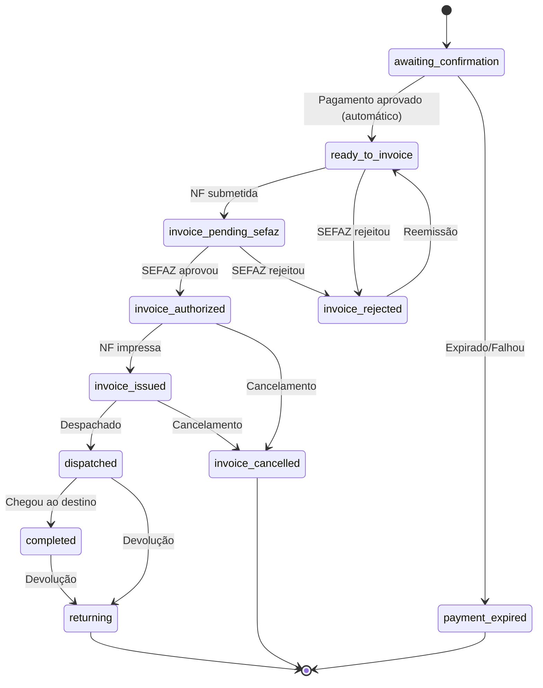
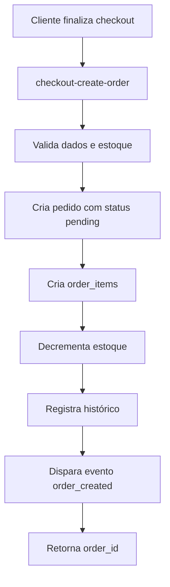
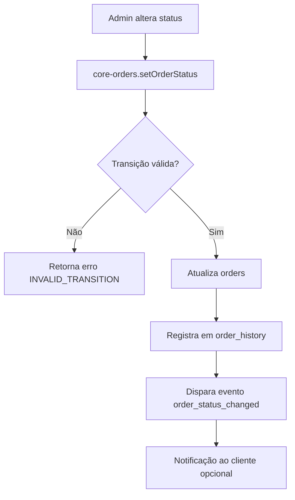

# Módulo: Pedidos (Admin)

> **Status**: ✅ Funcional e Protegido  
> **Última atualização**: 2026-03-10

---

## 1. Visão Geral

O módulo de Pedidos gerencia todo o ciclo de vida de uma venda, desde a criação até a entrega. Implementa uma máquina de estados para status do pedido, pagamento e envio, garantindo transições válidas. Todas as operações passam pela Edge Function `core-orders` para auditoria e consistência.

---

## 2. Arquitetura de Componentes

### 2.1 Páginas

| Arquivo | Responsabilidade |
|---------|------------------|
| `src/pages/Orders.tsx` | Lista de pedidos com filtros, estatísticas e paginação |
| `src/pages/OrderDetail.tsx` | Detalhes do pedido, itens, histórico, notas, rastreio |
| `src/pages/OrderNew.tsx` | Criação manual de pedidos |

### 2.2 Componentes

| Arquivo | Responsabilidade |
|---------|------------------|
| `src/components/orders/OrderList.tsx` | Tabela de pedidos com badges de status e ações |
| `src/components/orders/OrderSourceBadge.tsx` | Badge de origem (Loja, Mercado Livre, Shopee) |
| `src/components/orders/OrderShippingMethod.tsx` | Exibição do método de envio |
| `src/components/orders/ShipmentSection.tsx` | Seção de rastreio e envio |

### 2.3 Hooks

| Arquivo | Responsabilidade |
|---------|------------------|
| `src/hooks/useOrders.ts` | Lista, cria, atualiza status, deleta pedidos via coreOrdersApi |
| `src/hooks/useOrderDetails.ts` | Busca pedido por ID/número via Edge Function |
| `src/hooks/useCustomerOrders.ts` | Pedidos do cliente logado (storefront) |

### 2.4 Edge Functions

| Função | Responsabilidade |
|--------|------------------|
| `core-orders` | API canônica: createOrder, setOrderStatus, setPaymentStatus, setShippingStatus, addNote, updateTracking, deleteOrder |
| `get-order` | Busca segura de pedido (bypassa RLS para guest) |
| `checkout-create-order` | Criação de pedido via checkout do storefront |
| `shipment-ingest` | Ingestão de dados de envio/rastreio |

---

## 3. Modelo de Dados

### 3.1 Tabela `orders`

```typescript
interface Order {
  id: string;                    // UUID PK
  tenant_id: string;             // FK → tenants
  customer_id: string | null;    // FK → customers (opcional)
  order_number: string;          // Sequencial por tenant (ex: "ORD-0001")
  
  // === Status ===
  status: OrderStatus;
  payment_status: PaymentStatus;
  shipping_status: ShippingStatus;
  
  // === Valores ===
  subtotal: number;              // Soma dos itens
  discount_total: number;        // Descontos aplicados
  shipping_total: number;        // Frete
  tax_total: number;             // Impostos
  total: number;                 // subtotal - discount + shipping + tax
  
  // === Pagamento ===
  payment_method: PaymentMethod | null;
  payment_gateway: string | null;
  payment_gateway_id: string | null;
  paid_at: string | null;
  installments: number | null;
  installment_value: number | null;
  
  // === Envio ===
  shipping_carrier: string | null;
  shipping_service_code: string | null;
  shipping_service_name: string | null;
  shipping_estimated_days: number | null;
  tracking_code: string | null;
  tracking_url: string | null;
  shipped_at: string | null;
  delivered_at: string | null;
  
  // === Cliente ===
  customer_name: string;
  customer_email: string;        // Normalizado (lowercase, trim)
  customer_phone: string | null;
  customer_cpf: string | null;
  
  // === Endereço de Entrega ===
  shipping_street: string | null;
  shipping_number: string | null;
  shipping_complement: string | null;
  shipping_neighborhood: string | null;
  shipping_city: string | null;
  shipping_state: string | null;
  shipping_postal_code: string | null;
  shipping_country: string | null;
  
  // === Endereço de Cobrança ===
  billing_street: string | null;
  billing_number: string | null;
  billing_complement: string | null;
  billing_neighborhood: string | null;
  billing_city: string | null;
  billing_state: string | null;
  billing_postal_code: string | null;
  billing_country: string | null;
  
  // === Notas ===
  customer_notes: string | null;  // Observações do cliente
  internal_notes: string | null;  // Notas internas (não visíveis ao cliente)
  
  // === Cancelamento ===
  cancelled_at: string | null;
  cancellation_reason: string | null;
  
  // === Marketplace ===
  source_order_number: string | null;
  source_platform: string | null;
  marketplace_source: string | null;
  marketplace_order_id: string | null;
  marketplace_data: Record<string, unknown> | null;
  
  // === Metadados ===
  currency: string | null;       // Default: BRL
  fx_rate: number | null;
  source_hash: string | null;    // Para deduplicação
  gateway_payload: Record<string, unknown> | null;
  
  created_at: string;
  updated_at: string;
}
```

### 3.1.1 Regra de Pedidos Fantasma (Ghost Orders) — v2026-03-14

> **Adicionado em**: 2026-03-13  
> **Corrigido em**: 2026-03-14 (causa raiz: webhooks não gravavam `payment_gateway_id`)

| Campo | Valor |
|-------|-------|
| **Tipo** | Regra Lógica — CRÍTICA |
| **Localização** | `src/hooks/useOrders.ts`, `src/hooks/useCustomerOrders.ts`, `src/hooks/usePayments.ts`, `src/hooks/useDashboardMetrics.ts` |
| **Contexto** | Todas as listagens e métricas de pedidos (admin, storefront, pagamentos, dashboard) |
| **Descrição** | Pedidos criados no checkout mas que nunca chegaram ao gateway de pagamento não devem aparecer nas listas. São considerados "fantasmas". |
| **Comportamento** | O filtro canônico é: `.not('payment_gateway_id', 'is', null)`. Todo pedido real DEVE ter `payment_gateway_id` preenchido — isso é garantido por 3 pontos de gravação (ver abaixo). |
| **Condições** | Um pedido é fantasma quando: `payment_gateway_id IS NULL`. Sem exceção. |
| **Afeta** | `useOrders`, `useCustomerOrders`, `usePayments`, `useDashboardMetrics` — todas as queries de pedidos |
| **Erros/Edge cases** | O cron `expire-stale-orders` cancela esses pedidos após 30min e emite evento `order.ghost_cancelled`. **NÃO marca checkout_session como abandoned** (v2026-03-16: regra de separação abandono × operacional). |

**⚠️ REGRA DE OURO — Todo pedido real DEVE ter `payment_gateway_id`!**

O campo `payment_gateway_id` é a prova de que o pedido foi processado pela operadora de pagamento. Sem ele, o pedido é considerado um checkout abandonado e fica invisível em todas as listas.

**3 pontos de gravação garantem que `payment_gateway_id` seja sempre preenchido:**

| Ponto | Arquivo | Quando grava |
|-------|---------|--------------|
| 1. Função de cobrança (primário) | `pagarme-create-charge`, `mercadopago-create-charge` | Assim que a operadora responde, independente do status |
| 2. Webhook (redundância) | `pagarme-webhook`, `mercadopago-storefront-webhook` | Em toda notificação de pagamento, regrava como segurança |
| 3. Importação | `import-batch` | Ao importar pedidos de outras plataformas |

**Filtro canônico para TODAS as queries de pedidos:**
```
.not('payment_gateway_id', 'is', null)
```

**Checklist para novas queries de pedidos:**
- [ ] Usa o filtro `.not('payment_gateway_id', 'is', null)`?
- [ ] Aplica em TODAS as queries do mesmo hook (lista, stats, contagem)?

**Campo na UI:** O código da operadora é exibido na seção "Pagamento" dos detalhes do pedido, como "Código da operadora" (fonte monospace).

**Histórico de bug (2026-03-14):** Os webhooks do Pagar.me e Mercado Pago atualizavam o status de pagamento mas NÃO gravavam `payment_gateway_id`. Isso fez 32 pedidos da loja "Respeite o Homem" (27 com transação na operadora, incluindo 7 pagos) ficarem invisíveis. Corrigido adicionando gravação obrigatória de `payment_gateway` e `payment_gateway_id` nos webhooks, e preenchendo retroativamente os pedidos existentes via `payment_transactions`.

### 3.2 Tipos de Status (v2026-03-10 — Fluxo Fiscal Integrado)

> **IMPORTANTE:** A coluna "Status" reflete o **trabalho interno** do pedido, integrado ao módulo fiscal.
> As colunas "Envio" e "Pagamento" continuam independentes.

#### Status do Pedido (coluna "Status")

```typescript
type OrderStatus = 
  | 'awaiting_confirmation'    // Aguardando confirmação - Pedido não pago
  | 'ready_to_invoice'         // Pronto para emitir NF - Pagamento confirmado (automático)
  | 'invoice_pending_sefaz'    // Pendente SEFAZ - NF submetida à SEFAZ
  | 'invoice_authorized'       // NF Autorizada - SEFAZ aprovou, NF enviada ao cliente
  | 'invoice_issued'           // NF Emitida - NF impressa, preparando envio
  | 'dispatched'               // Despachado - Pacote despachado
  | 'completed'                // Concluído - Chegou ao destino
  | 'returning'                // Em devolução - NF de devolução emitida
  | 'payment_expired'          // Pagamento expirado - Não pago, expirou
  | 'invoice_rejected'         // NF Rejeitada - SEFAZ rejeitou
  | 'invoice_cancelled';       // NF Cancelada - Cancelada pós-autorização
```

#### Fluxo Visual do Status

```
Pedido criado → Aguardando confirmação
       │
       ├─ Pagamento expirado (PIX/Boleto/Cartão expirou ou falhou)
       │
       └─ Pagamento aprovado (automático via webhook) → Pronto para emitir NF
              │
              ├─ NF Rejeitada (SEFAZ rejeitou) → pode voltar para Pronto para emitir NF
              │
              └─ Pendente SEFAZ (NF submetida)
                     │
                     ├─ NF Rejeitada
                     │
                     └─ NF Autorizada (SEFAZ aprovou, enviada ao cliente)
                            │
                            ├─ NF Cancelada (cancelamento pós-autorização)
                            │
                            └─ NF Emitida (impressa, preparando envio)
                                   │
                                   └─ Despachado (pacote despachado)
                                          │
                                          ├─ Concluído (chegou ao destino)
                                          │
                                          └─ Em devolução (NF de devolução emitida)
```

#### Transição Automática

| Evento | De | Para | Mecanismo |
|--------|----|------|-----------|
| Webhook pagamento aprovado | `awaiting_confirmation` | `ready_to_invoice` | `pagarme-webhook` / `reconcile-payments` |
| PIX/Boleto expirado | `awaiting_confirmation` | `payment_expired` | `expire-stale-orders` (cron) |
| Pagamento recusado | `awaiting_confirmation` | `payment_expired` | `expire-stale-orders` (cron) |

#### Status de Pagamento (coluna "Pagamento") — SEM MUDANÇA

```typescript
type PaymentStatus = 
  | 'awaiting_payment'  // Aguardando pagamento
  | 'paid'              // Pago
  | 'declined'          // Recusado
  | 'cancelled'         // Cancelado
  | 'refunded';         // Estornado
```

#### Status de Envio (coluna "Envio") — SEM MUDANÇA

```typescript
type ShippingStatus = 
  | 'awaiting_shipment'  // Aguardando envio
  | 'label_generated'    // Etiqueta gerada
  | 'shipped'            // Enviado
  | 'in_transit'         // Em trânsito
  | 'arriving'           // Chegando
  | 'delivered'          // Entregue
  | 'problem'            // Problema no envio
  | 'awaiting_pickup'    // Aguardando retirada
  | 'returning'          // Em devolução
  | 'returned';          // Devolvido
```

### 3.3 Tabela `order_items`

```typescript
interface OrderItem {
  id: string;
  order_id: string;              // FK → orders
  product_id: string | null;     // FK → products (pode ser null se produto deletado)
  variant_id: string | null;     // FK → product_variants
  sku: string;
  product_name: string;
  variant_name: string | null;
  product_slug: string | null;
  product_image_url: string | null;
  quantity: number;
  unit_price: number;
  discount_amount: number;
  total_price: number;           // (unit_price * quantity) - discount
  weight: number | null;
  tax_amount: number | null;
  cost_price: number | null;
  barcode: string | null;
  ncm: string | null;
  tenant_id: string | null;
  created_at: string;
}
```

### 3.4 Tabela `order_history`

```typescript
interface OrderHistory {
  id: string;
  order_id: string;
  author_id: string | null;      // Quem fez a alteração
  action: string;                // Ex: "status_change", "note_added"
  previous_value: Record<string, unknown> | null;
  new_value: Record<string, unknown> | null;
  description: string | null;
  created_at: string;
}
```

---

## 4. Máquina de Estados

### 4.1 Transições de Status do Pedido (v2026-03-10)


```mermaid
stateDiagram-v2
    [*] --> awaiting_confirmation
    awaiting_confirmation --> ready_to_invoice: Pagamento aprovado (automático)
    awaiting_confirmation --> payment_expired: Expirado/Falhou
    ready_to_invoice --> invoice_pending_sefaz: NF submetida
    ready_to_invoice --> invoice_rejected: SEFAZ rejeitou
    invoice_pending_sefaz --> invoice_authorized: SEFAZ aprovou
    invoice_pending_sefaz --> invoice_rejected: SEFAZ rejeitou
    invoice_authorized --> invoice_issued: NF impressa
    invoice_authorized --> invoice_cancelled: Cancelamento
    invoice_issued --> dispatched: Despachado
    invoice_issued --> invoice_cancelled: Cancelamento
    dispatched --> completed: Chegou ao destino
    dispatched --> returning: Devolução
    completed --> returning: Devolução
    invoice_rejected --> ready_to_invoice: Reemissão
    payment_expired --> [*]
    invoice_cancelled --> [*]
    returning --> [*]
```

### 4.2 Transições de Status de Pagamento

| De | Para | Válido |
|----|------|--------|
| `awaiting_payment` | `paid`, `declined`, `cancelled` | ✅ |
| `paid` | `refunded` | ✅ |
| `declined` | `awaiting_payment`, `cancelled` | ✅ |
| `cancelled` | - | ❌ (final) |
| `refunded` | - | ❌ (final) |

### 4.3 Transições de Status de Envio

| De | Para | Válido |
|----|------|--------|
| `awaiting_shipment` | `label_generated`, `problem` | ✅ |
| `label_generated` | `shipped`, `problem` | ✅ |
| `shipped` | `in_transit`, `problem` | ✅ |
| `in_transit` | `arriving`, `delivered`, `problem`, `awaiting_pickup` | ✅ |
| `arriving` | `delivered`, `problem` | ✅ |
| `delivered` | `returning` | ✅ |
| `problem` | `awaiting_shipment`, `returning`, `returned` | ✅ |
| `awaiting_pickup` | `delivered`, `returning` | ✅ |
| `returning` | `returned` | ✅ |
| `returned` | - | ❌ (final) |

---

## 5. Fluxos de Negócio

### 5.1 Criação de Pedido (Checkout)


```mermaid
graph TD
    A[Cliente finaliza checkout] --> B[checkout-create-order]
    B --> C[Valida dados e estoque]
    C --> D[Cria pedido com status pending]
    D --> E[Cria order_items]
    E --> F[Decrementa estoque]
    F --> G[Registra histórico]
    G --> H[Dispara evento order_created]
    H --> I[Retorna order_id]
```

### 5.2 Atualização de Status


```mermaid
graph TD
    A[Admin altera status] --> B[core-orders.setOrderStatus]
    B --> C{Transição válida?}
    C -->|Não| D[Retorna erro INVALID_TRANSITION]
    C -->|Sim| E[Atualiza orders]
    E --> F[Registra em order_history]
    F --> G[Dispara evento order_status_changed]
    G --> H[Notificação ao cliente opcional]
```

### 5.3 Rastreio

1. Admin adiciona código de rastreio via `updateTracking`
2. Sistema chama `shipment-ingest` para criar registro de envio
3. Cron job `tracking-poll` consulta transportadora periodicamente
4. Atualizações refletem em `shipping_status`

---

## 6. UI/UX

### 6.1 Lista de Pedidos (v2026-03-13)

| Coluna | Largura | Conteúdo |
|--------|---------|----------|
| Pedido | 100px | OrderSourceBadge (sm) + número (font-semibold) |
| Cliente | min 180px | Nome (truncate 200px) + email (xs, truncate) |
| Status | 140px | Badge com ícone + label (text-xs, whitespace-nowrap) |
| Envio | 120px | Badge com ícone + tooltip (transportadora + rastreio) |
| Método | 90px | Label curta: PIX, Cartão, Boleto, Débito (text-xs font-medium) |
| Pagamento | 120px | Badge de status (text-xs, whitespace-nowrap) |
| Total | 110px, right | Valor (font-semibold) + badge "1ª" se first_sale |
| Data | 130px | Formato dd/mm/yyyy hh:mm (text-xs) |
| Ações | 40px | Dropdown (ver, alterar status, excluir) |

| Elemento | Comportamento |
|----------|---------------|
| Busca | Por número, nome ou email do cliente |
| Filtros | Status, pagamento, envio, período, data, **🆕 1ª Venda** |
| Estatísticas | Cards com pendentes, em separação, enviados |
| Origem | Badge indicando Loja própria ou Marketplace (size="sm") |
| **1ª Venda** | Badge compacta "1ª" exibida ao lado do valor total quando `is_first_sale = true` |
| Ações | Ver detalhes, atualizar status, excluir |
| Paginação | 50 por página |

### 6.1.0 Normalização de Status (CRÍTICO — ANTI-REGRESSÃO)

O banco de dados pode conter valores **legados** nos campos `status`, `payment_status` e `shipping_status` (ex: `'paid'`, `'approved'`, `'pending'`) que **não existem** nos configs atuais (`ORDER_STATUS_CONFIG`, `PAYMENT_STATUS_CONFIG`, `SHIPPING_STATUS_CONFIG`).

**REGRA OBRIGATÓRIA:** Todo lookup de status nos componentes de UI (`OrderList.tsx`, `OrderDetail.tsx`, etc.) **DEVE** usar as funções de normalização antes de acessar os configs:

```typescript
// ✅ CORRETO — normaliza valor legado para novo tipo
const normalizedStatus = normalizeOrderStatus(order.status);
const cfg = ORDER_STATUS_CONFIG[normalizedStatus];

// ❌ PROIBIDO — valor legado causa fallback incorreto
const cfg = ORDER_STATUS_CONFIG[order.status as OrderStatus] || ORDER_STATUS_CONFIG.awaiting_confirmation;
```

| Função | Arquivo | Mapeia |
|--------|---------|--------|
| `normalizeOrderStatus()` | `src/types/orderStatus.ts` | `pending→awaiting_confirmation`, `paid→ready_to_invoice`, `cancelled→payment_expired`, `delivered→completed`, etc. |
| `normalizePaymentStatus()` | `src/types/orderStatus.ts` | `approved→paid`, `pending→awaiting_payment`, etc. |
| `normalizeShippingStatus()` | `src/types/orderStatus.ts` | `pending→awaiting_shipment`, `processing→label_generated`, etc. |

Sem normalização, pedidos com status legado exibem badges errados (ex: pedido pago aparece como "Aguardando confirmação").

### 6.1.1 Flag "1ª Venda" (v2026-02-16)

- **Lógica:** Um pedido é marcado como "1ª venda" quando o `customer.total_orders <= 1` (cliente novo ou com apenas aquele pedido).
- **Implementação:** O hook `useOrders.ts` faz JOIN com `customers(total_orders)` e calcula `is_first_sale` no frontend.
- **UI:** Badge verde compacta `"1ª venda"` renderizada em `OrderList.tsx` ao lado da coluna de valor total.
- **Filtro:** Botão toggle `"🆕 1ª Venda"` na página `Orders.tsx` filtra apenas pedidos de clientes novos.

### 6.2 Detalhes do Pedido

| Seção | Conteúdo |
|-------|----------|
| **Cabeçalho** | Número, data, badges de status |
| **Cliente** | Nome, email, telefone, link para perfil |
| **Itens** | Lista com imagem, nome, quantidade, valor |
| **Valores** | Subtotal, desconto, frete, total |
| **Endereço** | Entrega e cobrança |
| **Pagamento** | Método, gateway, data de pagamento |
| **Tentativas de Pagamento** | Histórico de todas as tentativas (códigos, status, valores, erros) |
| **Envio** | Transportadora, código de rastreio, timeline |
| **Histórico** | Todas as alterações com timestamp e autor |
| **Notas** | Internas (admin) e do cliente |

### 6.2.1 Card: Tentativas de Pagamento (v2026-03-13)

| Campo | Valor |
|-------|-------|
| **Tipo** | Componente |
| **Localização** | `src/components/orders/PaymentAttemptsCard.tsx` |
| **Contexto** | Sidebar dos detalhes do pedido, entre "Pagamento" e "Remessa" |
| **Descrição** | Exibe o log completo de tentativas de pagamento para um pedido |
| **Comportamento** | 1. Busca registros de `payment_transactions` filtrados por `order_id`. 2. Exibe cada tentativa com: ícone de status, badge, data/hora, método (PIX/Cartão/Boleto), operadora (Pagar.me/Mercado Pago/PagBank), valor (**dividido por 100** pois o banco armazena em centavos), código da transação (monospace) e mensagem de erro (se houver). 3. Badge com contagem total de tentativas. 4. Ordenado por data descendente (mais recente primeiro). |
| **Condições** | Só renderiza se houver pelo menos 1 tentativa registrada |
| **Visual** | Card com ícone History, separadores entre tentativas, cores semânticas por status (verde=aprovado, vermelho=recusado, cinza=pendente) |
| **Afeta** | Nenhum outro componente |

**Hook relacionado:**

| Campo | Valor |
|-------|-------|
| **Tipo** | Hook |
| **Localização** | `src/hooks/usePaymentTransactions.ts` |
| **Descrição** | Busca tentativas de pagamento (`payment_transactions`) por `order_id` |
| **Comportamento** | Query react-query com `enabled: !!orderId`, retorna array de `PaymentTransaction` |

### 6.3 Abas

| Aba | Conteúdo |
|-----|----------|
| **Detalhes** | Informações principais do pedido |
| **Notificações** | Histórico de emails/SMS enviados |

---

## 7. Integração com Outros Módulos

| Módulo | Integração |
|--------|------------|
| **Clientes** | Pedido vinculado por `customer_email` |
| **Produtos** | Itens referenciam `product_id` |
| **Descontos** | `discount_total` e cupom aplicado |
| **Fiscal** | Geração de NF-e a partir do pedido |
| **Notificações** | Emails transacionais automáticos |
| **Marketplaces** | Sincronização com ML, Shopee, etc. |
| **Afiliados** | Comissão calculada a partir do pedido |

---

## 8. Métodos de Pagamento

```typescript
type PaymentMethod = 
  | 'pix'
  | 'credit_card'
  | 'debit_card'
  | 'boleto'
  | 'mercado_pago'
  | 'pagarme';
```

---

## 9. Origens de Pedido

| Origem | Descrição |
|--------|-----------|
| `null` | Loja própria (storefront) |
| `mercadolivre` | Mercado Livre |
| `shopee` | Shopee |
| `amazon` | Amazon |
| `magazineluiza` | Magazine Luiza |

---

## 10. Regras de Negócio

### 10.1 Numeração

- Formato: `#XXXX` (sequencial por tenant)
- Gerenciado pelo campo `next_order_number` na tabela `tenants`
- **Default para novos tenants: 1** (não mais 1000)
- Após importação, `next_order_number` é atualizado para MAX + 1
- Nunca reutilizado
- Próximo pedido após importar N pedidos = N + 1

### 10.2 Ordenação na Lista de Pedidos

- Pedidos são ordenados por `created_at DESC` (mais recente primeiro)
- Número maior = pedido mais recente = aparece primeiro

### 10.2 Exclusão

- Apenas pedidos com status `pending` ou `cancelled` podem ser excluídos
- Pedidos pagos/processados: cancelar, não excluir
- `core-orders.deleteOrder` valida regras

### 10.3 Estoque

- Decrementado na criação do pedido
- Revertido em cancelamento (se configurado)
- Não revertido em devolução (gestão manual)

---

## 11. Permissões (RBAC)

| Rota | Módulo | Submódulo |
|------|--------|-----------|
| `/orders` | `ecommerce` | `orders` |
| `/orders/:id` | `ecommerce` | `orders` |
| `/orders/new` | `ecommerce` | `orders` |

---

## 12. Arquivos Relacionados

- `src/pages/Orders.tsx`
- `src/pages/OrderDetail.tsx`
- `src/pages/OrderNew.tsx`
- `src/components/orders/*`
- `src/hooks/useOrders.ts`
- `src/hooks/useOrderDetails.ts`
- `src/types/orderStatus.ts`
- `src/lib/coreApi.ts` (coreOrdersApi)
- `supabase/functions/core-orders/`
- `supabase/functions/get-order/`
- `supabase/functions/checkout-create-order/`
- `supabase/functions/pagarme-webhook/` — sincroniza status via webhook + registra order_history
- `supabase/functions/expire-stale-orders/` — cancela pedidos expirados via cron + registra order_history

---

## 13. Ciclo de Vida Automatizado (v8.2.6)

### 13.1 Expiração Automática (cron: `expire-stale-orders-every-15m`)
| Tipo | Prazo | Ação |
|------|-------|------|
| PIX pendente | 1 hora | `status=cancelled`, `payment_status=cancelled` |
| Boleto pendente | 4 dias | `status=cancelled`, `payment_status=cancelled` |
| Pedido órfão (sem transação) | 30 min | `status=cancelled` |
| `payment_status=declined` + `status=pending` | Imediato | `status=cancelled` |

### 13.2 Registro em `order_history`
Mudanças de status feitas por **webhook** (`pagarme-webhook`) e **cron** (`expire-stale-orders`) agora são registradas automaticamente em `order_history`:
- `action`: `status_changed` ou `payment_status_changed`
- `previous_value` / `new_value`: JSON com campo e valor
- `description`: inclui origem (ex: "webhook Pagar.me", "PIX expirado (automático)")

### 13.3 [REMOVIDO] Prevenção de Duplicidade via pendingOrderRef (Checkout)
> **REMOVIDO em v8.15.0** — O checkout NÃO reutiliza mais pedidos. Cada finalização cria um pedido novo. A lógica de `PENDING_ORDER_KEY` / `pendingOrderRef` foi eliminada por causar pedidos fantasma (caso Odair #41). Pedidos órfãos são tratados pelo robô automático `expire-stale-orders`.

### 13.4 Ghost Order Rule (v2026-03-14 — CAUSA RAIZ CORRIGIDA)

**Regra fundamental**: Um pedido só é pedido se tem `payment_gateway_id`. Sem esse código, é checkout abandonado.

**Filtro canônico (obrigatório em TODAS as queries de pedidos):**
```
.not('payment_gateway_id', 'is', null)
```

**Garantia tripla de gravação do `payment_gateway_id`:**

| Ponto | Função | Quando |
|-------|--------|--------|
| 1. Função de cobrança | `pagarme-create-charge`, `mercadopago-create-charge`, `pagbank-create-charge` | Ao receber resposta da operadora (QUALQUER status: paid, pending, failed) |
| 2. Webhook (redundância) | `pagarme-webhook`, `mercadopago-storefront-webhook` | Em toda notificação de pagamento |
| 3. Importação | `import-batch` | Ao importar de outras plataformas |

**REGRA CRÍTICA (v2026-03-14b):** O `payment_gateway_id` é gravado **independente do status do pagamento**. Mesmo que o cartão seja recusado, o pedido recebe o código da operadora e aparece na listagem. A lógica é: se a operadora respondeu (com sucesso ou recusa), o pedido é real. Sem resposta da operadora = checkout abandonado.

| Ponto de uso | Filtro |
|-------|---------------|
| **Admin (`useOrders.ts`)** | `.not('payment_gateway_id', 'is', null)` |
| **Admin (`usePayments.ts`)** | `.not('payment_gateway_id', 'is', null)` |
| **Admin (`useDashboardMetrics.ts`)** | `.not('payment_gateway_id', 'is', null)` |
| **Storefront (`useCustomerOrders.ts`)** | `.not('payment_gateway_id', 'is', null)` |
| **Cron (`expire-stale-orders`)** | `.is('payment_gateway_id', null)` + `payment_status = pending` → cancela após 30min |

**Campo na UI:** "Código da operadora" exibido na seção Pagamento dos detalhes do pedido (`OrderDetail.tsx`).

**Fluxo do ghost order:**
1. Cliente inicia checkout → pedido criado no banco (sem `payment_gateway_id`)
2. Função de cobrança envia para operadora → grava `payment_gateway_id` (ponto 1) — mesmo que recusado
3. Webhook confirma status → regrava `payment_gateway_id` como redundância (ponto 2)
4. Se nenhum dos dois gravou → pedido é fantasma → cron cancela em 30min → vira checkout abandonado

**Histórico de bugs:**
- **v2026-03-14:** Webhooks não gravavam `payment_gateway_id`. 32 pedidos invisíveis. Corrigido.
- **v2026-03-14b:** `mercadopago-create-charge` não gravava código em pagamentos recusados. `pagbank-create-charge` não sincronizava pedido de forma alguma. Corrigido.

---

## 14. Regras Visuais — Responsividade Mobile

| Elemento | Comportamento Mobile | Arquivo |
|----------|---------------------|---------|
| **Tabela de pedidos** | `overflow-x-auto` com `min-w-[900px]` — scroll horizontal no celular | `OrderList.tsx` |
| **Filtros** | SelectTrigger usa `w-full sm:w-44` — ocupa largura total no celular, fixo no desktop | `Orders.tsx` |
| **Container de filtros** | `flex-wrap w-full sm:w-auto` — empilha verticalmente no celular | `Orders.tsx` |
| **Paginação** | Botões de número escondidos no celular (`hidden sm:flex`), mostra apenas "Anterior / X de Y / Próximo" | `Orders.tsx` |
| **Texto da paginação** | `text-center sm:text-left` — centralizado no celular | `Orders.tsx` |
| **Container da paginação** | `flex-col gap-3 sm:flex-row` — empilha no celular | `Orders.tsx` |

---

## 16. Etapa 6B — Visibilidade de Retentativas e Recusados no Admin

### 16.1 Vínculo Bidirecional de Retry

| Campo | Valor |
|-------|-------|
| **Tipo** | Regra Lógica + Componente |
| **Localização** | `src/hooks/useRetryLinkedOrder.ts`, `src/pages/OrderDetail.tsx` |
| **Descrição** | Quando um pedido é retentativa de outro (via `retry_from_order_id`), banners bidirecionais aparecem no detalhe do pedido |
| **Comportamento** | 1. Se o pedido atual tem `retry_from_order_id`: banner azul "Este pedido foi criado como retentativa do pedido #X" com link. 2. Se outro pedido aponta para o atual: banner amarelo "Este pedido foi substituído pelo pedido #Y" com link. |
| **Visual** | Banners renderizados entre o header e as tabs. Azul (info) para retentativa, amarelo (warning) para substituído. |
| **Afeta** | Navegação entre pedidos vinculados |

### 16.2 Ícone de Retry na Lista

| Campo | Valor |
|-------|-------|
| **Tipo** | Componente Visual |
| **Localização** | `src/components/orders/OrderList.tsx` |
| **Descrição** | Ícone de link (Link2) ao lado do número do pedido quando `retry_from_order_id` existe |
| **Comportamento** | Tooltip exibe "Retentativa de pagamento" |
| **Visual** | Ícone `Link2` com cor `text-info`, 3.5x3.5 |

### 16.3 Histórico de Tentativas de Pagamento

| Campo | Valor |
|-------|-------|
| **Tipo** | Componente |
| **Localização** | `src/components/orders/PaymentAttemptsCard.tsx` (integrado em `OrderDetail.tsx` linha 472) |
| **Descrição** | Card que exibe o histórico de tentativas de pagamento via `payment_transactions` |
| **Comportamento** | Renderiza: status, método, valor, data, ID do gateway (`provider_transaction_id`) e mensagem de erro quando existir. Oculto se não há tentativas. |
| **Condições** | Sempre visível no detalhe do pedido quando há transações registradas |

### 16.4 Stat Card "Recusados"

| Campo | Valor |
|-------|-------|
| **Tipo** | Componente + Hook |
| **Localização** | `src/pages/Payments.tsx`, `src/hooks/usePayments.ts` |
| **Descrição** | Card de estatística mostrando contagem e valor total de pedidos recusados no mês |
| **Comportamento** | Exibe `declinedCount` como valor principal e `declinedTotal` formatado como descrição |
| **Visual** | Variante `destructive`, ícone `XCircle`. Grid expandido para 5 colunas. |

### 16.5 Integridade do GMV

GMV e receita continuam filtrando apenas `payment_status = 'approved'`. Pedidos recusados e substituídos **não** entram no GMV. Sem distorção.

---

## 17. Pendências

- [ ] Exportação de pedidos (CSV/Excel)
- [ ] Impressão de etiqueta de envio integrada
- [ ] Split de pedido (múltiplos envios)
- [ ] Edição de itens após criação
- [ ] Reembolso parcial
